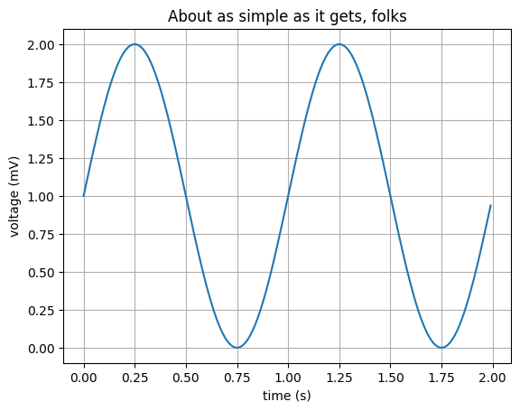

# ML-Machine-Learning

| GitHub Repo |🍭 [ML](https://github.com/akashdip2001/ML-Machine-Learning) 🍭|🐥 [Pandas](https://github.com/akashdip2001/ML-Machine-Learning/tree/main/pandas) 🐥|❌ [numPy](https://github.com/akashdip2001/ML-Machine-Learning/tree/main/numPy) ❌|
|-------------------- |-------------------- |-------------------- |-------------------- |


| WebSite => |🍭 [ML](https://akashdip2001.github.io/ML-Machine-Learning/) 🍭|🐥 [Pandas](https://akashdip2001.github.io/ML-Machine-Learning/pandas.html) 🐥|❌ [numPy](https://akashdip2001.github.io/ML-Machine-Learning/numPy.html) ❌|
|-------------------- |-------------------- |-------------------- |-------------------- |


| python 10h => |🍭 [SourceCode](https://github.com/akashdip2001/Python-Course-10h) 🍭|🐥 [Notes 10h]() 🐥|❌ [complete Notes](https://www.codewithharry.com/notes/) ❌|
|-------------------- |-------------------- |-------------------- |-------------------- |


# [Pandas](https://github.com/akashdip2001/ML-Machine-Learning/tree/main/pandas)

### Downlod [Pythin](https://www.python.org/downloads/_)

Run Command Prompt as Administrator:

  - Right-click on the Command Prompt icon in the Start menu.
  - Select "Run as administrator".
  - Confirm the User Account Control prompt if prompted.

```python
!pip install pandas
!pip install jupyter
# If you want to install matplotlib as well, uncomment the line below
# !pip install matplotlib

!jupyter notebook --version

```

```
jupyter notebook
```


```python
import numpy as np
import matplotlib.pyplot as plt

# Data for plotting
t = np.arange(0.0, 2.0, 0.01)
s = 1 + np.sin(2 * np.pi * t)

fig, ax = plt.subplots()
ax.plot(t, s)

ax.set(xlabel='time (s)', ylabel='voltage (mV)',
       title='About as simple as it gets, folks')
ax.grid()

plt.show()
```


    


| more about [pamdas](https://github.com/akashdip2001/ML-Machine-Learning/tree/main/pandas) |
|---

# [numPy](https://github.com/akashdip2001/ML-Machine-Learning/tree/main/numPy)

#### [documentation](https://numpy.org/doc/stable/reference/)

```python
pip install numpy
python.exe -m pip install --upgrade pip

pip install jupyter
```
