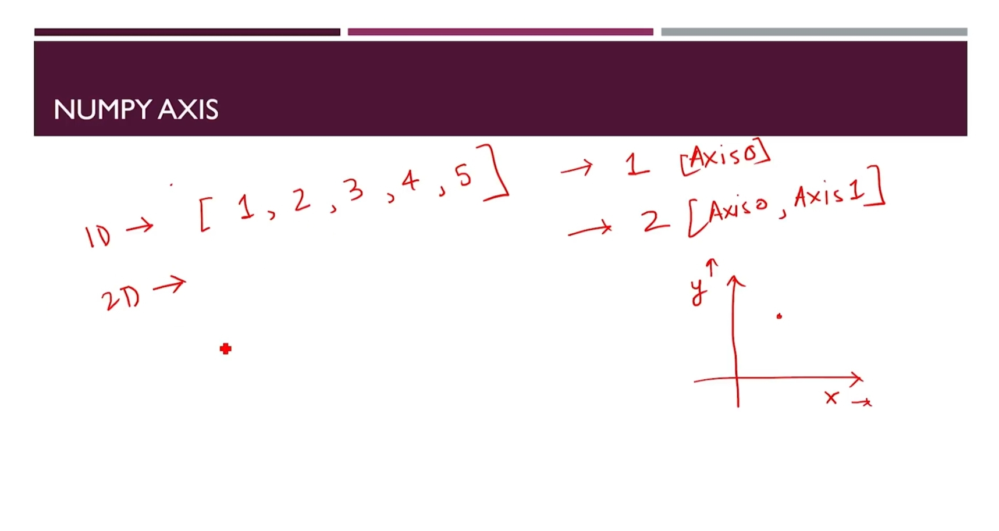
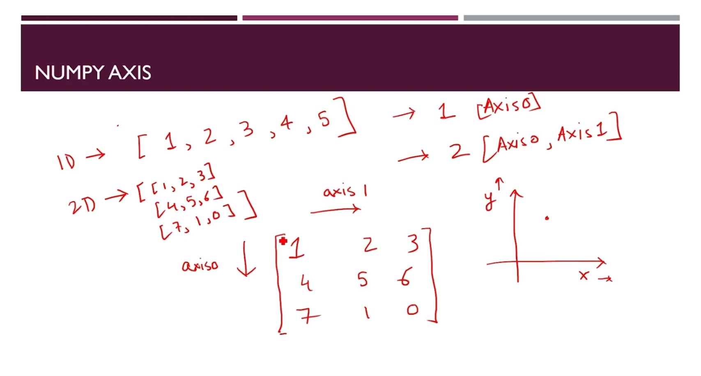
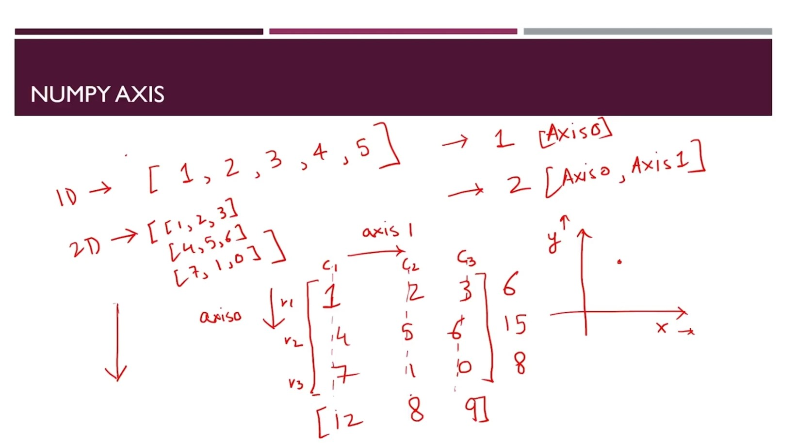

# numPy
<p align="middle">
  
</p>

#### [documentation](https://numpy.org/doc/stable/reference/)

| GitHub Repo |🍭 [ML](https://github.com/akashdip2001/ML-Machine-Learning) 🍭|🐥 [Pandas](https://github.com/akashdip2001/ML-Machine-Learning/tree/main/pandas) 🐥|❌ [numPy](https://github.com/akashdip2001/ML-Machine-Learning/tree/main/numPy) ❌|
|-------------------- |-------------------- |-------------------- |-------------------- |


| WebSite => |🍭 [ML](https://akashdip2001.github.io/ML-Machine-Learning/) 🍭|🐥 [Pandas](https://akashdip2001.github.io/ML-Machine-Learning/pandas.html) 🐥|❌ [numPy](https://akashdip2001.github.io/ML-Machine-Learning/numPy.html) ❌|
|-------------------- |-------------------- |-------------------- |-------------------- |

<p float="left">
  
    
    
</p>


```python
import numpy as np
```

### 1D Array [documentation](https://numpy.org/doc/stable/user/basics.creation.html)


```python
myarr = np.array([3,6,32,7])
```


```python
myarr
```


    array([ 3,  6, 32,  7])


```python
#myarr = np.array([3,6,32888888,7], np.int8) => ❌ Memory size < number
myarr = np.array([3,6,32888888,7], np.int32)
myarr
```


    array([       3,        6, 32888888,        7], dtype=int32)


```python
myarr[0]  #1D Array => [ ], 2D Array [ , ]
```


    np.int32(3)


### 2D Array


```python
myarr = np.array([[3,6,32,7]], np.int64)
myarr
```


    array([[ 3,  6, 32,  7]])


```python
myarr[0,1]
```


    np.int64(6)


```python
myarr.dtype
```


    dtype('int64')


### Change the no in Array


```python
myarr[0,1] = 45
myarr
```


    array([[ 3, 45, 32,  7]])


## Array_1) Conversion from other Python structures


```python
listarray = np.array([[1,2,3], [5,8,5], [0,3,1]])
listarray
```


    array([[1, 2, 3],
           [5, 8, 5],
           [0, 3, 1]])


```python
listarray.dtype
```


    dtype('int64')


```python
listarray.shape
```


    (3, 3)


```python
listarray.size
```


    9


```python
np.array({34,23,53})    #not use Obj => use int or Float => for Mathematical cal...
```


    array({34, 53, 23}, dtype=object)


## Array_2) Intrinsic NumPy array creation functions


```python
zeros = np.zeros((2, 5))
zeros
```


    array([[0., 0., 0., 0., 0.],
           [0., 0., 0., 0., 0.]])


```python
# 3 in 1
print("Data type:", listarray.dtype)
print("Shape:", listarray.shape)
print("Size:", listarray.size)
```

    Data type: int64
    Shape: (3, 3)
    Size: 9
    


```python
rng = np.arange(15)  #arange create => numPy array
rng
```


    array([ 0,  1,  2,  3,  4,  5,  6,  7,  8,  9, 10, 11, 12, 13, 14])


```python
lspace = np.linspace(1,10,10)    # 1 to 10 => total 10 equally space
lspace
```


    array([ 1.,  2.,  3.,  4.,  5.,  6.,  7.,  8.,  9., 10.])


```python
lspace = np.linspace(1,50,10)   # 1 to 50 => total 10 equally space
lspace
```


    array([ 1.        ,  6.44444444, 11.88888889, 17.33333333, 22.77777778,
           28.22222222, 33.66666667, 39.11111111, 44.55555556, 50.        ])


#### Empty Array


```python
emp = np.empty((4,6))  # 4X6 => Random elemants
emp
```


    array([[ 1.08907377e-311,  6.79453105e-313,  1.08858384e-311,
             6.79453105e-313,  3.25959773e-310, -4.34679076e-311],
           [ 2.75164205e-135, -5.97648350e-311,  1.08730858e+270,
             5.43432418e+279,  6.01433264e+175,  2.79195069e-152],
           [ 7.62873624e+228,  1.49292415e-090,  6.10935453e+223,
             6.19637392e+223,  8.02146756e+165,  1.50761589e+161],
           [ 6.01334642e-154,  2.43567289e-152,  3.81435356e+228,
             8.92892664e+271,  4.77800043e+180,  6.01334515e-154]])


#### Emply Array in Old place (=> Random)
##### np.empty_like([Old_Array-Name])


```python
emp_like = np.empty_like(lspace)
emp_like
```


    array([ 1.        ,  6.44444444, 11.88888889, 17.33333333, 22.77777778,
           28.22222222, 33.66666667, 39.11111111, 44.55555556, 50.        ])


#### identity Matrix


```python
ide = np.identity(3)
ide
```


    array([[1., 0., 0.],
           [0., 1., 0.],
           [0., 0., 1.]])


```python
ide = np.identity(45)
ide
```


    array([[1., 0., 0., ..., 0., 0., 0.],
           [0., 1., 0., ..., 0., 0., 0.],
           [0., 0., 1., ..., 0., 0., 0.],
           ...,
           [0., 0., 0., ..., 1., 0., 0.],
           [0., 0., 0., ..., 0., 1., 0.],
           [0., 0., 0., ..., 0., 0., 1.]])


```python
ide.shape
```


    (45, 45)


### ReShape (if possible)


```python
arr = np.arange(33)
arr
```


    array([ 0,  1,  2,  3,  4,  5,  6,  7,  8,  9, 10, 11, 12, 13, 14, 15, 16,
           17, 18, 19, 20, 21, 22, 23, 24, 25, 26, 27, 28, 29, 30, 31, 32])


```python
arr.reshape(11, 3)
```


    array([[ 0,  1,  2],
           [ 3,  4,  5],
           [ 6,  7,  8],
           [ 9, 10, 11],
           [12, 13, 14],
           [15, 16, 17],
           [18, 19, 20],
           [21, 22, 23],
           [24, 25, 26],
           [27, 28, 29],
           [30, 31, 32]])


```python
arr.reshape(3, 11)
```


    array([[ 0,  1,  2,  3,  4,  5,  6,  7,  8,  9, 10],
           [11, 12, 13, 14, 15, 16, 17, 18, 19, 20, 21],
           [22, 23, 24, 25, 26, 27, 28, 29, 30, 31, 32]])


# But

arr.reshape(3, 10) ❌

### Ravel , 2D => 1D Array


```python
arr = arr.reshape(3, 11)
arr
```


    array([[ 0,  1,  2,  3,  4,  5,  6,  7,  8,  9, 10],
           [11, 12, 13, 14, 15, 16, 17, 18, 19, 20, 21],
           [22, 23, 24, 25, 26, 27, 28, 29, 30, 31, 32]])


```python
arr.shape
```


    (3, 11)


```python
arr = arr.ravel()
arr
```


    array([ 0,  1,  2,  3,  4,  5,  6,  7,  8,  9, 10, 11, 12, 13, 14, 15, 16,
           17, 18, 19, 20, 21, 22, 23, 24, 25, 26, 27, 28, 29, 30, 31, 32])


```python
arr.shape
```


    (33,)


# Theory

<p float="left">
    
</p>


```python
x = [[1,2,3], [4,5,6], [7,1,0]]
```


```python
ar = np.array(x)
ar
```


    array([[1, 2, 3],
           [4, 5, 6],
           [7, 1, 0]])


### Sum


```python
ar.sum(axis=0)
```


    array([12,  8,  9])


```python
ar.sum(axis=1)
```


    array([ 6, 15,  8])


### Transpose


```python
ar.T
```


    array([[1, 4, 7],
           [2, 5, 1],
           [3, 6, 0]])


### flat


```python
ar.flat
```


    <numpy.flatiter at 0x1789ce4c2f0>


```python
for item in ar.flat:
    print(item)
```

    1
    2
    3
    4
    5
    6
    7
    1
    0
    


```python
ar.ndim  # no of Dinension
```


    2


```python
ar.size
```


    9


```python
ar.nbytes # Total bite consumes
```


    72


#### Max - Min in Array


```python
one = np.array([1,2,4,888,2]) # Create a 1D Array
```


```python
one.argmax()
```


    np.int64(3)


```python
one.argmin()
```


    np.int64(0)


```python
one.argsort() # Max => Min
```


    array([0, 1, 4, 2, 3])


```python
ar
```


    array([[1, 2, 3],
           [4, 5, 6],
           [7, 1, 0]])


```python
ar.argmax()  # Max value in the 6th place
```


    np.int64(6)


```python
ar.argmin()
```


    np.int64(8)


```python
ar.argmax(axis=0)  # Max elimants in every Columns
```


    array([2, 1, 1])


```python
ar.argmax(axis=1) # Max elements in every Row
```


    array([2, 2, 0])


```python
ar.argsort(axis=0)  # Max => Min elimants in every Columns
```


    array([[0, 2, 2],
           [1, 0, 0],
           [2, 1, 1]])


```python
ar.argsort(axis=1)  # Min => Max elimants in every Columns
```


    array([[0, 1, 2],
           [0, 1, 2],
           [2, 1, 0]])


---


```python
ar.ravel()
```


    array([1, 2, 3, 4, 5, 6, 7, 1, 0])


```python
ar.reshape(9, 1 )
```


    array([[1],
           [2],
           [3],
           [4],
           [5],
           [6],
           [7],
           [1],
           [0]])


```python
ar.reshape(9,)
```


    array([1, 2, 3, 4, 5, 6, 7, 1, 0])


# Sum of 2 Array


```python
ar
```


    array([[1, 2, 3],
           [4, 5, 6],
           [7, 1, 0]])


```python
ar2 = np.array([[1, 2, 1],
              [4, 0, 6],
              [8, 1, 0]])
```


```python
ar + ar2
```


    array([[ 2,  4,  4],
           [ 8,  5, 12],
           [15,  2,  0]])


# But


```python
[324, 34] + [34, 546]
```


    [324, 34, 34, 546]


# X


```python
ar * ar2
```


    array([[ 1,  4,  3],
           [16,  0, 36],
           [56,  1,  0]])


# ²√


```python
np.sqrt(ar)
```


    array([[1.        , 1.41421356, 1.73205081],
           [2.        , 2.23606798, 2.44948974],
           [2.64575131, 1.        , 0.        ]])


# Sum


```python
ar.sum()
```


    np.int64(29)


# Max - Min


```python
ar.max()
```


    np.int64(7)


```python
ar.min()
```


    np.int64(0)


# Find / Filter


```python
ar
```


    array([[1, 2, 3],
           [4, 5, 6],
           [7, 1, 0]])


```python
np.where(ar>5)
```


    (array([1, 2]), array([2, 0]))


```python
type(np.where(ar>5))
```


    tuple


```python
np.count_nonzero(ar)
```


    8


```python
np.nonzero(ar)
```


    (array([0, 0, 0, 1, 1, 1, 2, 2]), array([0, 1, 2, 0, 1, 2, 0, 1]))


```python
ar[1, 2] = 0
np.nonzero(ar)
```


    (array([0, 0, 0, 1, 1, 2, 2]), array([0, 1, 2, 0, 1, 0, 1]))


it's give 'tuple' for every Dimension (for every axis)

# Memory Management
### => numPy Array (take size in memory)


```python
import sys
```


```python
python_array = [0,4,55,2]
```


```python
numPy_array = np.array(python_array)
```


```python
sys.getsizeof(1) * len(python_array)
```


    112


```python
numPy_array.itemsize * numPy_array.size
```


    32


### Goohle shearch => numPy array methods & attributes
