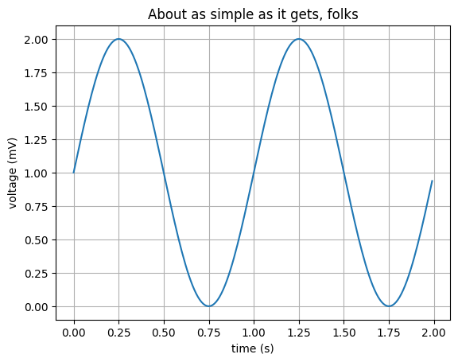

# Pandas 


| GitHub Repo |🍭 [ML](https://www.mediafire.com/file/njc51t2ierhir85/akashdipmahapatraFreeCAD.apk/file) 🍭|🐥 [Pandas](https://akashdip2001.github.io/freecad_app/) 🐥|❌ [numPy](https://engineering-aot.github.io/custom-video-player/freecad_exam.html) ❌|
|-------------------- |-------------------- |-------------------- |-------------------- |


| WebSite => |🍭 [ML](https://akashdip2001.github.io/ML-Machine-Learning/) 🍭|🐥 [Pandas](https://akashdip2001.github.io/ML-Machine-Learning/pandas.html) 🐥|❌ [numPy](https://akashdip2001.github.io/ML-Machine-Learning/numPy.html) ❌|
|-------------------- |-------------------- |-------------------- |-------------------- |

```python
import numpy as np
import matplotlib.pyplot as plt

# Data for plotting
t = np.arange(0.0, 2.0, 0.01)
s = 1 + np.sin(2 * np.pi * t)

fig, ax = plt.subplots()
ax.plot(t, s)

ax.set(xlabel='time (s)', ylabel='voltage (mV)',
       title='About as simple as it gets, folks')
ax.grid()

plt.show()
```


    

    


```python
import numpy as np # type: ignore
import pandas as pd # type: ignore
```


```python
dict1 = {
    "name":['Akash', 'Arka', 'Megha', 'Sahil'],
    "marks":[98, 87, 38, 27],
    "fav_sub":['math', 'phy', 'chemistory', 'History']
}
```


```python
df = pd.DataFrame(dict1)
```

<h4>DataFrame => like a Excel seat</h4>


```python
df
```


<div>

<table border="1" class="dataframe">
  <thead>
    <tr style="text-align: right;">
      <th></th>
      <th>name</th>
      <th>marks</th>
      <th>fav_sub</th>
    </tr>
  </thead>
  <tbody>
    <tr>
      <th>0</th>
      <td>Akash</td>
      <td>98</td>
      <td>math</td>
    </tr>
    <tr>
      <th>1</th>
      <td>Arka</td>
      <td>87</td>
      <td>phy</td>
    </tr>
    <tr>
      <th>2</th>
      <td>Megha</td>
      <td>38</td>
      <td>chemistory</td>
    </tr>
    <tr>
      <th>3</th>
      <td>Sahil</td>
      <td>27</td>
      <td>History</td>
    </tr>
  </tbody>
</table>
</div>


```python
df.head(2) #.head() => use for to see only 2 Rows
```


<div>

<table border="1" class="dataframe">
  <thead>
    <tr style="text-align: right;">
      <th></th>
      <th>name</th>
      <th>marks</th>
      <th>fav_sub</th>
    </tr>
  </thead>
  <tbody>
    <tr>
      <th>0</th>
      <td>Akash</td>
      <td>98</td>
      <td>math</td>
    </tr>
    <tr>
      <th>1</th>
      <td>Arka</td>
      <td>87</td>
      <td>phy</td>
    </tr>
  </tbody>
</table>
</div>


```python
df.tail(2)
```


<div>

<table border="1" class="dataframe">
  <thead>
    <tr style="text-align: right;">
      <th></th>
      <th>name</th>
      <th>marks</th>
      <th>fav_sub</th>
    </tr>
  </thead>
  <tbody>
    <tr>
      <th>2</th>
      <td>Megha</td>
      <td>38</td>
      <td>chemistory</td>
    </tr>
    <tr>
      <th>3</th>
      <td>Sahil</td>
      <td>27</td>
      <td>History</td>
    </tr>
  </tbody>
</table>
</div>


```python
df.describe()
```


<div>

<table border="1" class="dataframe">
  <thead>
    <tr style="text-align: right;">
      <th></th>
      <th>marks</th>
    </tr>
  </thead>
  <tbody>
    <tr>
      <th>count</th>
      <td>4.000000</td>
    </tr>
    <tr>
      <th>mean</th>
      <td>62.500000</td>
    </tr>
    <tr>
      <th>std</th>
      <td>35.218366</td>
    </tr>
    <tr>
      <th>min</th>
      <td>27.000000</td>
    </tr>
    <tr>
      <th>25%</th>
      <td>35.250000</td>
    </tr>
    <tr>
      <th>50%</th>
      <td>62.500000</td>
    </tr>
    <tr>
      <th>75%</th>
      <td>89.750000</td>
    </tr>
    <tr>
      <th>max</th>
      <td>98.000000</td>
    </tr>
  </tbody>
</table>
</div>


#### TO export as a Excel seat => to_CSV


```python
df.to_csv('exam.csv')
```


```python
df.to_csv('exam_index_false.csv', index=False)
```

#### To see Any Excel file exist on the folder

#### [variable] = pd.read_CSV('fileName')


```python
new01 = pd.read_csv('new.csv')
```


```python
new01
```


<div>

<table border="1" class="dataframe">
  <thead>
    <tr style="text-align: right;">
      <th></th>
      <th>s_name</th>
      <th>marks</th>
      <th>fav_sub</th>
    </tr>
  </thead>
  <tbody>
    <tr>
      <th>0</th>
      <td>Ak</td>
      <td>78</td>
      <td>math</td>
    </tr>
    <tr>
      <th>1</th>
      <td>Ar</td>
      <td>87</td>
      <td>phy</td>
    </tr>
    <tr>
      <th>2</th>
      <td>Me</td>
      <td>38</td>
      <td>chem</td>
    </tr>
    <tr>
      <th>3</th>
      <td>Sa</td>
      <td>27</td>
      <td>History</td>
    </tr>
  </tbody>
</table>
</div>


```python
new01['fav_sub']
```


    0       math
    1        phy
    2       chem
    3    History
    Name: fav_sub, dtype: object


```python
new01['fav_sub'][3]
```


    'History'


```python
new01['fav_sub'][3] = 'His'
```

    C:\Users\akash\AppData\Local\Temp\ipykernel_13816\3023452953.py:1: SettingWithCopyWarning: 
    A value is trying to be set on a copy of a slice from a DataFrame
    
    See the caveats in the documentation: https://pandas.pydata.org/pandas-docs/stable/user_guide/indexing.html#returning-a-view-versus-a-copy
      new01['fav_sub'][3] = 'His'
    


```python
new01
```


<div>

<table border="1" class="dataframe">
  <thead>
    <tr style="text-align: right;">
      <th></th>
      <th>s_name</th>
      <th>marks</th>
      <th>fav_sub</th>
    </tr>
  </thead>
  <tbody>
    <tr>
      <th>0</th>
      <td>Ak</td>
      <td>78</td>
      <td>math</td>
    </tr>
    <tr>
      <th>1</th>
      <td>Ar</td>
      <td>87</td>
      <td>phy</td>
    </tr>
    <tr>
      <th>2</th>
      <td>Me</td>
      <td>38</td>
      <td>chem</td>
    </tr>
    <tr>
      <th>3</th>
      <td>Sa</td>
      <td>27</td>
      <td>His</td>
    </tr>
  </tbody>
</table>
</div>


```python
new01.loc[3, 'marks'] = 7
```


```python
new01
```


<div>

<table border="1" class="dataframe">
  <thead>
    <tr style="text-align: right;">
      <th></th>
      <th>s_name</th>
      <th>marks</th>
      <th>fav_sub</th>
    </tr>
  </thead>
  <tbody>
    <tr>
      <th>0</th>
      <td>Ak</td>
      <td>78</td>
      <td>math</td>
    </tr>
    <tr>
      <th>1</th>
      <td>Ar</td>
      <td>87</td>
      <td>phy</td>
    </tr>
    <tr>
      <th>2</th>
      <td>Me</td>
      <td>38</td>
      <td>chem</td>
    </tr>
    <tr>
      <th>3</th>
      <td>Sa</td>
      <td>7</td>
      <td>His</td>
    </tr>
  </tbody>
</table>
</div>


```python
new01.index = ['one', 'two', 'three', 'four']
```


```python
new01
```


<div>

<table border="1" class="dataframe">
  <thead>
    <tr style="text-align: right;">
      <th></th>
      <th>s_name</th>
      <th>marks</th>
      <th>fav_sub</th>
    </tr>
  </thead>
  <tbody>
    <tr>
      <th>one</th>
      <td>Ak</td>
      <td>78</td>
      <td>math</td>
    </tr>
    <tr>
      <th>two</th>
      <td>Ar</td>
      <td>87</td>
      <td>phy</td>
    </tr>
    <tr>
      <th>three</th>
      <td>Me</td>
      <td>38</td>
      <td>chem</td>
    </tr>
    <tr>
      <th>four</th>
      <td>Sa</td>
      <td>7</td>
      <td>His</td>
    </tr>
  </tbody>
</table>
</div>


# Theoretical Consepts

<p float="left">
  
  
  
</p>

#### create a randome searies


```python
ser = pd.Series(np.random.rand(14))
```


```python
ser
```


    0     0.592982
    1     0.089134
    2     0.298535
    3     0.807671
    4     0.725485
    5     0.687012
    6     0.816261
    7     0.094089
    8     0.588830
    9     0.058438
    10    0.733875
    11    0.679545
    12    0.989181
    13    0.012679
    dtype: float64


```python
type(ser)
```


    pandas.core.series.Series


##### it says its a series, Series is a dataSteacture in Pandas(basic index). 

#### create a randome DataFrame


```python
newdf = pd.DataFrame(np.random.rand(334,5))
```


```python
newdf
```


<div>

<table border="1" class="dataframe">
  <thead>
    <tr style="text-align: right;">
      <th></th>
      <th>0</th>
      <th>1</th>
      <th>2</th>
      <th>3</th>
      <th>4</th>
    </tr>
  </thead>
  <tbody>
    <tr>
      <th>0</th>
      <td>0.389816</td>
      <td>0.277731</td>
      <td>0.067042</td>
      <td>0.002059</td>
      <td>0.407727</td>
    </tr>
    <tr>
      <th>1</th>
      <td>0.551456</td>
      <td>0.168457</td>
      <td>0.250771</td>
      <td>0.227765</td>
      <td>0.034904</td>
    </tr>
    <tr>
      <th>2</th>
      <td>0.049185</td>
      <td>0.015945</td>
      <td>0.573349</td>
      <td>0.311257</td>
      <td>0.093050</td>
    </tr>
    <tr>
      <th>3</th>
      <td>0.752881</td>
      <td>0.330371</td>
      <td>0.712297</td>
      <td>0.964221</td>
      <td>0.871224</td>
    </tr>
    <tr>
      <th>4</th>
      <td>0.465920</td>
      <td>0.524635</td>
      <td>0.168582</td>
      <td>0.700223</td>
      <td>0.253482</td>
    </tr>
    <tr>
      <th>...</th>
      <td>...</td>
      <td>...</td>
      <td>...</td>
      <td>...</td>
      <td>...</td>
    </tr>
    <tr>
      <th>329</th>
      <td>0.658090</td>
      <td>0.293046</td>
      <td>0.298604</td>
      <td>0.715905</td>
      <td>0.996943</td>
    </tr>
    <tr>
      <th>330</th>
      <td>0.936951</td>
      <td>0.874560</td>
      <td>0.610748</td>
      <td>0.330604</td>
      <td>0.761028</td>
    </tr>
    <tr>
      <th>331</th>
      <td>0.579128</td>
      <td>0.903851</td>
      <td>0.007002</td>
      <td>0.679941</td>
      <td>0.622195</td>
    </tr>
    <tr>
      <th>332</th>
      <td>0.404665</td>
      <td>0.657996</td>
      <td>0.696272</td>
      <td>0.264398</td>
      <td>0.477333</td>
    </tr>
    <tr>
      <th>333</th>
      <td>0.475313</td>
      <td>0.764407</td>
      <td>0.285640</td>
      <td>0.148084</td>
      <td>0.184530</td>
    </tr>
  </tbody>
</table>
<p>334 rows × 5 columns</p>
</div>


```python
type(newdf)
```


    pandas.core.frame.DataFrame


```python
newdf.head() #.head() => use for to see only some 1st Rows
```


<div>

<table border="1" class="dataframe">
  <thead>
    <tr style="text-align: right;">
      <th></th>
      <th>0</th>
      <th>1</th>
      <th>2</th>
      <th>3</th>
      <th>4</th>
    </tr>
  </thead>
  <tbody>
    <tr>
      <th>0</th>
      <td>0.389816</td>
      <td>0.277731</td>
      <td>0.067042</td>
      <td>0.002059</td>
      <td>0.407727</td>
    </tr>
    <tr>
      <th>1</th>
      <td>0.551456</td>
      <td>0.168457</td>
      <td>0.250771</td>
      <td>0.227765</td>
      <td>0.034904</td>
    </tr>
    <tr>
      <th>2</th>
      <td>0.049185</td>
      <td>0.015945</td>
      <td>0.573349</td>
      <td>0.311257</td>
      <td>0.093050</td>
    </tr>
    <tr>
      <th>3</th>
      <td>0.752881</td>
      <td>0.330371</td>
      <td>0.712297</td>
      <td>0.964221</td>
      <td>0.871224</td>
    </tr>
    <tr>
      <th>4</th>
      <td>0.465920</td>
      <td>0.524635</td>
      <td>0.168582</td>
      <td>0.700223</td>
      <td>0.253482</td>
    </tr>
  </tbody>
</table>
</div>


```python
newdf.describe()
```


<div>

<table border="1" class="dataframe">
  <thead>
    <tr style="text-align: right;">
      <th></th>
      <th>0</th>
      <th>1</th>
      <th>2</th>
      <th>3</th>
      <th>4</th>
    </tr>
  </thead>
  <tbody>
    <tr>
      <th>count</th>
      <td>334.000000</td>
      <td>334.000000</td>
      <td>334.000000</td>
      <td>334.000000</td>
      <td>334.000000</td>
    </tr>
    <tr>
      <th>mean</th>
      <td>0.501553</td>
      <td>0.472939</td>
      <td>0.479780</td>
      <td>0.492751</td>
      <td>0.487873</td>
    </tr>
    <tr>
      <th>std</th>
      <td>0.293815</td>
      <td>0.283570</td>
      <td>0.293866</td>
      <td>0.290158</td>
      <td>0.279634</td>
    </tr>
    <tr>
      <th>min</th>
      <td>0.000840</td>
      <td>0.005290</td>
      <td>0.004672</td>
      <td>0.002059</td>
      <td>0.001112</td>
    </tr>
    <tr>
      <th>25%</th>
      <td>0.240961</td>
      <td>0.229260</td>
      <td>0.241328</td>
      <td>0.249245</td>
      <td>0.258360</td>
    </tr>
    <tr>
      <th>50%</th>
      <td>0.508086</td>
      <td>0.461424</td>
      <td>0.457971</td>
      <td>0.479577</td>
      <td>0.492049</td>
    </tr>
    <tr>
      <th>75%</th>
      <td>0.753612</td>
      <td>0.709813</td>
      <td>0.740625</td>
      <td>0.745304</td>
      <td>0.737618</td>
    </tr>
    <tr>
      <th>max</th>
      <td>0.999334</td>
      <td>0.999793</td>
      <td>0.996112</td>
      <td>0.999076</td>
      <td>0.996943</td>
    </tr>
  </tbody>
</table>
</div>


```python
newdf.dtypes
```


    0    float64
    1    float64
    2    float64
    3    float64
    4    float64
    dtype: object


#### Now i can change the 1st Matrix =>> float => Obj


```python
newdf[0][0] = "Akashdip"
```

    C:\Users\akash\AppData\Local\Temp\ipykernel_13816\3796500939.py:1: FutureWarning: ChainedAssignmentError: behaviour will change in pandas 3.0!
    You are setting values through chained assignment. Currently this works in certain cases, but when using Copy-on-Write (which will become the default behaviour in pandas 3.0) this will never work to update the original DataFrame or Series, because the intermediate object on which we are setting values will behave as a copy.
    A typical example is when you are setting values in a column of a DataFrame, like:
    
    df["col"][row_indexer] = value
    
    Use `df.loc[row_indexer, "col"] = values` instead, to perform the assignment in a single step and ensure this keeps updating the original `df`.
    
    See the caveats in the documentation: https://pandas.pydata.org/pandas-docs/stable/user_guide/indexing.html#returning-a-view-versus-a-copy
    
      newdf[0][0] = "Akashdip"
    C:\Users\akash\AppData\Local\Temp\ipykernel_13816\3796500939.py:1: FutureWarning: Setting an item of incompatible dtype is deprecated and will raise an error in a future version of pandas. Value 'Akashdip' has dtype incompatible with float64, please explicitly cast to a compatible dtype first.
      newdf[0][0] = "Akashdip"
    


```python
newdf.dtypes
```


    0     object
    1    float64
    2    float64
    3    float64
    4    float64
    dtype: object


```python
newdf.head() #.head() => use for to see only some 1st Rows
```


<div>

<table border="1" class="dataframe">
  <thead>
    <tr style="text-align: right;">
      <th></th>
      <th>0</th>
      <th>1</th>
      <th>2</th>
      <th>3</th>
      <th>4</th>
    </tr>
  </thead>
  <tbody>
    <tr>
      <th>0</th>
      <td>Akashdip</td>
      <td>0.277731</td>
      <td>0.067042</td>
      <td>0.002059</td>
      <td>0.407727</td>
    </tr>
    <tr>
      <th>1</th>
      <td>0.551456</td>
      <td>0.168457</td>
      <td>0.250771</td>
      <td>0.227765</td>
      <td>0.034904</td>
    </tr>
    <tr>
      <th>2</th>
      <td>0.049185</td>
      <td>0.015945</td>
      <td>0.573349</td>
      <td>0.311257</td>
      <td>0.093050</td>
    </tr>
    <tr>
      <th>3</th>
      <td>0.752881</td>
      <td>0.330371</td>
      <td>0.712297</td>
      <td>0.964221</td>
      <td>0.871224</td>
    </tr>
    <tr>
      <th>4</th>
      <td>0.46592</td>
      <td>0.524635</td>
      <td>0.168582</td>
      <td>0.700223</td>
      <td>0.253482</td>
    </tr>
  </tbody>
</table>
</div>


```python
newdf.index
```


    RangeIndex(start=0, stop=334, step=1)


```python
newdf.columns
```


    RangeIndex(start=0, stop=5, step=1)


Change the Floating no. => NumPy Array


```python
newdf.to_numpy()
```


    array([['Akashdip', 0.27773135663513493, 0.06704239674025736,
            0.002058762489740573, 0.40772714713412517],
           [0.5514556477387098, 0.16845724510300986, 0.2507710458028566,
            0.22776535709646395, 0.034903682183624385],
           [0.049185468422066836, 0.01594489815219091, 0.573348537547269,
            0.31125687790862666, 0.0930503093220586],
           ...,
           [0.5791281877494598, 0.9038505949780049, 0.007002318814000819,
            0.6799414283271692, 0.6221952704928537],
           [0.40466493063332654, 0.6579961619568181, 0.696271964279979,
            0.2643979913156512, 0.47733316205867904],
           [0.4753132905460734, 0.764407092326054, 0.2856398615723992,
            0.14808400696797597, 0.18452973892199265]], dtype=object)


```python
newdf[1][0] = "Megha"
newdf[2][0] = "Vii"
```

    C:\Users\akash\AppData\Local\Temp\ipykernel_13816\1671826079.py:1: FutureWarning: ChainedAssignmentError: behaviour will change in pandas 3.0!
    You are setting values through chained assignment. Currently this works in certain cases, but when using Copy-on-Write (which will become the default behaviour in pandas 3.0) this will never work to update the original DataFrame or Series, because the intermediate object on which we are setting values will behave as a copy.
    A typical example is when you are setting values in a column of a DataFrame, like:
    
    df["col"][row_indexer] = value
    
    Use `df.loc[row_indexer, "col"] = values` instead, to perform the assignment in a single step and ensure this keeps updating the original `df`.
    
    See the caveats in the documentation: https://pandas.pydata.org/pandas-docs/stable/user_guide/indexing.html#returning-a-view-versus-a-copy
    
      newdf[1][0] = "Megha"
    C:\Users\akash\AppData\Local\Temp\ipykernel_13816\1671826079.py:1: SettingWithCopyWarning: 
    A value is trying to be set on a copy of a slice from a DataFrame
    
    See the caveats in the documentation: https://pandas.pydata.org/pandas-docs/stable/user_guide/indexing.html#returning-a-view-versus-a-copy
      newdf[1][0] = "Megha"
    C:\Users\akash\AppData\Local\Temp\ipykernel_13816\1671826079.py:1: FutureWarning: Setting an item of incompatible dtype is deprecated and will raise an error in a future version of pandas. Value 'Megha' has dtype incompatible with float64, please explicitly cast to a compatible dtype first.
      newdf[1][0] = "Megha"
    C:\Users\akash\AppData\Local\Temp\ipykernel_13816\1671826079.py:2: FutureWarning: ChainedAssignmentError: behaviour will change in pandas 3.0!
    You are setting values through chained assignment. Currently this works in certain cases, but when using Copy-on-Write (which will become the default behaviour in pandas 3.0) this will never work to update the original DataFrame or Series, because the intermediate object on which we are setting values will behave as a copy.
    A typical example is when you are setting values in a column of a DataFrame, like:
    
    df["col"][row_indexer] = value
    
    Use `df.loc[row_indexer, "col"] = values` instead, to perform the assignment in a single step and ensure this keeps updating the original `df`.
    
    See the caveats in the documentation: https://pandas.pydata.org/pandas-docs/stable/user_guide/indexing.html#returning-a-view-versus-a-copy
    
      newdf[2][0] = "Vii"
    C:\Users\akash\AppData\Local\Temp\ipykernel_13816\1671826079.py:2: SettingWithCopyWarning: 
    A value is trying to be set on a copy of a slice from a DataFrame
    
    See the caveats in the documentation: https://pandas.pydata.org/pandas-docs/stable/user_guide/indexing.html#returning-a-view-versus-a-copy
      newdf[2][0] = "Vii"
    C:\Users\akash\AppData\Local\Temp\ipykernel_13816\1671826079.py:2: FutureWarning: Setting an item of incompatible dtype is deprecated and will raise an error in a future version of pandas. Value 'Vii' has dtype incompatible with float64, please explicitly cast to a compatible dtype first.
      newdf[2][0] = "Vii"
    


```python
newdf.head() #.head() => use for to see only some 1st Rows
```


<div>

<table border="1" class="dataframe">
  <thead>
    <tr style="text-align: right;">
      <th></th>
      <th>0</th>
      <th>1</th>
      <th>2</th>
      <th>3</th>
      <th>4</th>
    </tr>
  </thead>
  <tbody>
    <tr>
      <th>0</th>
      <td>Akashdip</td>
      <td>Megha</td>
      <td>Vii</td>
      <td>0.002059</td>
      <td>0.407727</td>
    </tr>
    <tr>
      <th>1</th>
      <td>0.551456</td>
      <td>0.168457</td>
      <td>0.250771</td>
      <td>0.227765</td>
      <td>0.034904</td>
    </tr>
    <tr>
      <th>2</th>
      <td>0.049185</td>
      <td>0.015945</td>
      <td>0.573349</td>
      <td>0.311257</td>
      <td>0.093050</td>
    </tr>
    <tr>
      <th>3</th>
      <td>0.752881</td>
      <td>0.330371</td>
      <td>0.712297</td>
      <td>0.964221</td>
      <td>0.871224</td>
    </tr>
    <tr>
      <th>4</th>
      <td>0.46592</td>
      <td>0.524635</td>
      <td>0.168582</td>
      <td>0.700223</td>
      <td>0.253482</td>
    </tr>
  </tbody>
</table>
</div>


### Transpose the Matrix => [name].T


```python
newdfT = newdf.T
```


```python
newdfT
```


<div>

<table border="1" class="dataframe">
  <thead>
    <tr style="text-align: right;">
      <th></th>
      <th>0</th>
      <th>1</th>
      <th>2</th>
      <th>3</th>
      <th>4</th>
      <th>5</th>
      <th>6</th>
      <th>7</th>
      <th>8</th>
      <th>9</th>
      <th>...</th>
      <th>324</th>
      <th>325</th>
      <th>326</th>
      <th>327</th>
      <th>328</th>
      <th>329</th>
      <th>330</th>
      <th>331</th>
      <th>332</th>
      <th>333</th>
    </tr>
  </thead>
  <tbody>
    <tr>
      <th>0</th>
      <td>Akashdip</td>
      <td>0.551456</td>
      <td>0.049185</td>
      <td>0.752881</td>
      <td>0.46592</td>
      <td>0.115716</td>
      <td>0.732449</td>
      <td>0.928998</td>
      <td>0.170095</td>
      <td>0.824551</td>
      <td>...</td>
      <td>0.709232</td>
      <td>0.726485</td>
      <td>0.541627</td>
      <td>0.199381</td>
      <td>0.76012</td>
      <td>0.65809</td>
      <td>0.936951</td>
      <td>0.579128</td>
      <td>0.404665</td>
      <td>0.475313</td>
    </tr>
    <tr>
      <th>1</th>
      <td>Megha</td>
      <td>0.168457</td>
      <td>0.015945</td>
      <td>0.330371</td>
      <td>0.524635</td>
      <td>0.313838</td>
      <td>0.741647</td>
      <td>0.678394</td>
      <td>0.196528</td>
      <td>0.441784</td>
      <td>...</td>
      <td>0.286521</td>
      <td>0.971222</td>
      <td>0.05676</td>
      <td>0.755876</td>
      <td>0.433215</td>
      <td>0.293046</td>
      <td>0.87456</td>
      <td>0.903851</td>
      <td>0.657996</td>
      <td>0.764407</td>
    </tr>
    <tr>
      <th>2</th>
      <td>Vii</td>
      <td>0.250771</td>
      <td>0.573349</td>
      <td>0.712297</td>
      <td>0.168582</td>
      <td>0.698928</td>
      <td>0.336394</td>
      <td>0.143204</td>
      <td>0.461934</td>
      <td>0.254511</td>
      <td>...</td>
      <td>0.409366</td>
      <td>0.020349</td>
      <td>0.96238</td>
      <td>0.139122</td>
      <td>0.440167</td>
      <td>0.298604</td>
      <td>0.610748</td>
      <td>0.007002</td>
      <td>0.696272</td>
      <td>0.28564</td>
    </tr>
    <tr>
      <th>3</th>
      <td>0.002059</td>
      <td>0.227765</td>
      <td>0.311257</td>
      <td>0.964221</td>
      <td>0.700223</td>
      <td>0.709153</td>
      <td>0.04126</td>
      <td>0.136492</td>
      <td>0.815731</td>
      <td>0.264296</td>
      <td>...</td>
      <td>0.517396</td>
      <td>0.379384</td>
      <td>0.999076</td>
      <td>0.39289</td>
      <td>0.900842</td>
      <td>0.715905</td>
      <td>0.330604</td>
      <td>0.679941</td>
      <td>0.264398</td>
      <td>0.148084</td>
    </tr>
    <tr>
      <th>4</th>
      <td>0.407727</td>
      <td>0.034904</td>
      <td>0.09305</td>
      <td>0.871224</td>
      <td>0.253482</td>
      <td>0.027255</td>
      <td>0.755582</td>
      <td>0.18779</td>
      <td>0.668777</td>
      <td>0.574324</td>
      <td>...</td>
      <td>0.352012</td>
      <td>0.253975</td>
      <td>0.072396</td>
      <td>0.293267</td>
      <td>0.304728</td>
      <td>0.996943</td>
      <td>0.761028</td>
      <td>0.622195</td>
      <td>0.477333</td>
      <td>0.18453</td>
    </tr>
  </tbody>
</table>
<p>5 rows × 334 columns</p>
</div>


```python
newdfT.sort_index(axis=0, ascending=False)
```


<div>

<table border="1" class="dataframe">
  <thead>
    <tr style="text-align: right;">
      <th></th>
      <th>0</th>
      <th>1</th>
      <th>2</th>
      <th>3</th>
      <th>4</th>
      <th>5</th>
      <th>6</th>
      <th>7</th>
      <th>8</th>
      <th>9</th>
      <th>...</th>
      <th>324</th>
      <th>325</th>
      <th>326</th>
      <th>327</th>
      <th>328</th>
      <th>329</th>
      <th>330</th>
      <th>331</th>
      <th>332</th>
      <th>333</th>
    </tr>
  </thead>
  <tbody>
    <tr>
      <th>4</th>
      <td>0.407727</td>
      <td>0.034904</td>
      <td>0.09305</td>
      <td>0.871224</td>
      <td>0.253482</td>
      <td>0.027255</td>
      <td>0.755582</td>
      <td>0.18779</td>
      <td>0.668777</td>
      <td>0.574324</td>
      <td>...</td>
      <td>0.352012</td>
      <td>0.253975</td>
      <td>0.072396</td>
      <td>0.293267</td>
      <td>0.304728</td>
      <td>0.996943</td>
      <td>0.761028</td>
      <td>0.622195</td>
      <td>0.477333</td>
      <td>0.18453</td>
    </tr>
    <tr>
      <th>3</th>
      <td>0.002059</td>
      <td>0.227765</td>
      <td>0.311257</td>
      <td>0.964221</td>
      <td>0.700223</td>
      <td>0.709153</td>
      <td>0.04126</td>
      <td>0.136492</td>
      <td>0.815731</td>
      <td>0.264296</td>
      <td>...</td>
      <td>0.517396</td>
      <td>0.379384</td>
      <td>0.999076</td>
      <td>0.39289</td>
      <td>0.900842</td>
      <td>0.715905</td>
      <td>0.330604</td>
      <td>0.679941</td>
      <td>0.264398</td>
      <td>0.148084</td>
    </tr>
    <tr>
      <th>2</th>
      <td>Vii</td>
      <td>0.250771</td>
      <td>0.573349</td>
      <td>0.712297</td>
      <td>0.168582</td>
      <td>0.698928</td>
      <td>0.336394</td>
      <td>0.143204</td>
      <td>0.461934</td>
      <td>0.254511</td>
      <td>...</td>
      <td>0.409366</td>
      <td>0.020349</td>
      <td>0.96238</td>
      <td>0.139122</td>
      <td>0.440167</td>
      <td>0.298604</td>
      <td>0.610748</td>
      <td>0.007002</td>
      <td>0.696272</td>
      <td>0.28564</td>
    </tr>
    <tr>
      <th>1</th>
      <td>Megha</td>
      <td>0.168457</td>
      <td>0.015945</td>
      <td>0.330371</td>
      <td>0.524635</td>
      <td>0.313838</td>
      <td>0.741647</td>
      <td>0.678394</td>
      <td>0.196528</td>
      <td>0.441784</td>
      <td>...</td>
      <td>0.286521</td>
      <td>0.971222</td>
      <td>0.05676</td>
      <td>0.755876</td>
      <td>0.433215</td>
      <td>0.293046</td>
      <td>0.87456</td>
      <td>0.903851</td>
      <td>0.657996</td>
      <td>0.764407</td>
    </tr>
    <tr>
      <th>0</th>
      <td>Akashdip</td>
      <td>0.551456</td>
      <td>0.049185</td>
      <td>0.752881</td>
      <td>0.46592</td>
      <td>0.115716</td>
      <td>0.732449</td>
      <td>0.928998</td>
      <td>0.170095</td>
      <td>0.824551</td>
      <td>...</td>
      <td>0.709232</td>
      <td>0.726485</td>
      <td>0.541627</td>
      <td>0.199381</td>
      <td>0.76012</td>
      <td>0.65809</td>
      <td>0.936951</td>
      <td>0.579128</td>
      <td>0.404665</td>
      <td>0.475313</td>
    </tr>
  </tbody>
</table>
<p>5 rows × 334 columns</p>
</div>


### axis=0 => Row
### axis=1 => Column


```python
newdf.sort_index(axis=0, ascending=False)
```


<div>

<table border="1" class="dataframe">
  <thead>
    <tr style="text-align: right;">
      <th></th>
      <th>0</th>
      <th>1</th>
      <th>2</th>
      <th>3</th>
      <th>4</th>
    </tr>
  </thead>
  <tbody>
    <tr>
      <th>333</th>
      <td>0.475313</td>
      <td>0.764407</td>
      <td>0.28564</td>
      <td>0.148084</td>
      <td>0.184530</td>
    </tr>
    <tr>
      <th>332</th>
      <td>0.404665</td>
      <td>0.657996</td>
      <td>0.696272</td>
      <td>0.264398</td>
      <td>0.477333</td>
    </tr>
    <tr>
      <th>331</th>
      <td>0.579128</td>
      <td>0.903851</td>
      <td>0.007002</td>
      <td>0.679941</td>
      <td>0.622195</td>
    </tr>
    <tr>
      <th>330</th>
      <td>0.936951</td>
      <td>0.87456</td>
      <td>0.610748</td>
      <td>0.330604</td>
      <td>0.761028</td>
    </tr>
    <tr>
      <th>329</th>
      <td>0.65809</td>
      <td>0.293046</td>
      <td>0.298604</td>
      <td>0.715905</td>
      <td>0.996943</td>
    </tr>
    <tr>
      <th>...</th>
      <td>...</td>
      <td>...</td>
      <td>...</td>
      <td>...</td>
      <td>...</td>
    </tr>
    <tr>
      <th>4</th>
      <td>0.46592</td>
      <td>0.524635</td>
      <td>0.168582</td>
      <td>0.700223</td>
      <td>0.253482</td>
    </tr>
    <tr>
      <th>3</th>
      <td>0.752881</td>
      <td>0.330371</td>
      <td>0.712297</td>
      <td>0.964221</td>
      <td>0.871224</td>
    </tr>
    <tr>
      <th>2</th>
      <td>0.049185</td>
      <td>0.015945</td>
      <td>0.573349</td>
      <td>0.311257</td>
      <td>0.093050</td>
    </tr>
    <tr>
      <th>1</th>
      <td>0.551456</td>
      <td>0.168457</td>
      <td>0.250771</td>
      <td>0.227765</td>
      <td>0.034904</td>
    </tr>
    <tr>
      <th>0</th>
      <td>Akashdip</td>
      <td>Megha</td>
      <td>Vii</td>
      <td>0.002059</td>
      <td>0.407727</td>
    </tr>
  </tbody>
</table>
<p>334 rows × 5 columns</p>
</div>


```python
newdf.sort_index(axis=1, ascending=False)
```


<div>

<table border="1" class="dataframe">
  <thead>
    <tr style="text-align: right;">
      <th></th>
      <th>4</th>
      <th>3</th>
      <th>2</th>
      <th>1</th>
      <th>0</th>
    </tr>
  </thead>
  <tbody>
    <tr>
      <th>0</th>
      <td>0.407727</td>
      <td>0.002059</td>
      <td>Vii</td>
      <td>Megha</td>
      <td>Akashdip</td>
    </tr>
    <tr>
      <th>1</th>
      <td>0.034904</td>
      <td>0.227765</td>
      <td>0.250771</td>
      <td>0.168457</td>
      <td>0.551456</td>
    </tr>
    <tr>
      <th>2</th>
      <td>0.093050</td>
      <td>0.311257</td>
      <td>0.573349</td>
      <td>0.015945</td>
      <td>0.049185</td>
    </tr>
    <tr>
      <th>3</th>
      <td>0.871224</td>
      <td>0.964221</td>
      <td>0.712297</td>
      <td>0.330371</td>
      <td>0.752881</td>
    </tr>
    <tr>
      <th>4</th>
      <td>0.253482</td>
      <td>0.700223</td>
      <td>0.168582</td>
      <td>0.524635</td>
      <td>0.46592</td>
    </tr>
    <tr>
      <th>...</th>
      <td>...</td>
      <td>...</td>
      <td>...</td>
      <td>...</td>
      <td>...</td>
    </tr>
    <tr>
      <th>329</th>
      <td>0.996943</td>
      <td>0.715905</td>
      <td>0.298604</td>
      <td>0.293046</td>
      <td>0.65809</td>
    </tr>
    <tr>
      <th>330</th>
      <td>0.761028</td>
      <td>0.330604</td>
      <td>0.610748</td>
      <td>0.87456</td>
      <td>0.936951</td>
    </tr>
    <tr>
      <th>331</th>
      <td>0.622195</td>
      <td>0.679941</td>
      <td>0.007002</td>
      <td>0.903851</td>
      <td>0.579128</td>
    </tr>
    <tr>
      <th>332</th>
      <td>0.477333</td>
      <td>0.264398</td>
      <td>0.696272</td>
      <td>0.657996</td>
      <td>0.404665</td>
    </tr>
    <tr>
      <th>333</th>
      <td>0.184530</td>
      <td>0.148084</td>
      <td>0.28564</td>
      <td>0.764407</td>
      <td>0.475313</td>
    </tr>
  </tbody>
</table>
<p>334 rows × 5 columns</p>
</div>


```python
newdf[0]
```


    0      Akashdip
    1      0.551456
    2      0.049185
    3      0.752881
    4       0.46592
             ...   
    329     0.65809
    330    0.936951
    331    0.579128
    332    0.404665
    333    0.475313
    Name: 0, Length: 334, dtype: object


```python
type(newdf[0])
```


    pandas.core.series.Series


### it's a Series ⬆️
every Row is a Series => 1D array of index

# Copy
### newdf_2 = newdf.copy()


```python
newdf.head() #.head() => use for to see only some 1st Rows
```


<div>

<table border="1" class="dataframe">
  <thead>
    <tr style="text-align: right;">
      <th></th>
      <th>0</th>
      <th>1</th>
      <th>2</th>
      <th>3</th>
      <th>4</th>
    </tr>
  </thead>
  <tbody>
    <tr>
      <th>0</th>
      <td>Akashdip</td>
      <td>Megha</td>
      <td>Vii</td>
      <td>0.002059</td>
      <td>0.407727</td>
    </tr>
    <tr>
      <th>1</th>
      <td>0.551456</td>
      <td>0.168457</td>
      <td>0.250771</td>
      <td>0.227765</td>
      <td>0.034904</td>
    </tr>
    <tr>
      <th>2</th>
      <td>0.049185</td>
      <td>0.015945</td>
      <td>0.573349</td>
      <td>0.311257</td>
      <td>0.093050</td>
    </tr>
    <tr>
      <th>3</th>
      <td>0.752881</td>
      <td>0.330371</td>
      <td>0.712297</td>
      <td>0.964221</td>
      <td>0.871224</td>
    </tr>
    <tr>
      <th>4</th>
      <td>0.46592</td>
      <td>0.524635</td>
      <td>0.168582</td>
      <td>0.700223</td>
      <td>0.253482</td>
    </tr>
  </tbody>
</table>
</div>


```python
newdf_2 = newdf.copy()
```


```python
newdf_2.head() #.head() => use for to see only some 1st Rows
```


<div>

<table border="1" class="dataframe">
  <thead>
    <tr style="text-align: right;">
      <th></th>
      <th>0</th>
      <th>1</th>
      <th>2</th>
      <th>3</th>
      <th>4</th>
    </tr>
  </thead>
  <tbody>
    <tr>
      <th>0</th>
      <td>Akashdip</td>
      <td>Megha</td>
      <td>Vii</td>
      <td>0.002059</td>
      <td>0.407727</td>
    </tr>
    <tr>
      <th>1</th>
      <td>0.551456</td>
      <td>0.168457</td>
      <td>0.250771</td>
      <td>0.227765</td>
      <td>0.034904</td>
    </tr>
    <tr>
      <th>2</th>
      <td>0.049185</td>
      <td>0.015945</td>
      <td>0.573349</td>
      <td>0.311257</td>
      <td>0.093050</td>
    </tr>
    <tr>
      <th>3</th>
      <td>0.752881</td>
      <td>0.330371</td>
      <td>0.712297</td>
      <td>0.964221</td>
      <td>0.871224</td>
    </tr>
    <tr>
      <th>4</th>
      <td>0.46592</td>
      <td>0.524635</td>
      <td>0.168582</td>
      <td>0.700223</td>
      <td>0.253482</td>
    </tr>
  </tbody>
</table>
</div>


```python
newdf_2[0][0] = 0.0001
```

    C:\Users\akash\AppData\Local\Temp\ipykernel_13816\1230259220.py:1: FutureWarning: ChainedAssignmentError: behaviour will change in pandas 3.0!
    You are setting values through chained assignment. Currently this works in certain cases, but when using Copy-on-Write (which will become the default behaviour in pandas 3.0) this will never work to update the original DataFrame or Series, because the intermediate object on which we are setting values will behave as a copy.
    A typical example is when you are setting values in a column of a DataFrame, like:
    
    df["col"][row_indexer] = value
    
    Use `df.loc[row_indexer, "col"] = values` instead, to perform the assignment in a single step and ensure this keeps updating the original `df`.
    
    See the caveats in the documentation: https://pandas.pydata.org/pandas-docs/stable/user_guide/indexing.html#returning-a-view-versus-a-copy
    
      newdf_2[0][0] = 0.0001
    C:\Users\akash\AppData\Local\Temp\ipykernel_13816\1230259220.py:1: SettingWithCopyWarning: 
    A value is trying to be set on a copy of a slice from a DataFrame
    
    See the caveats in the documentation: https://pandas.pydata.org/pandas-docs/stable/user_guide/indexing.html#returning-a-view-versus-a-copy
      newdf_2[0][0] = 0.0001
    


```python
newdf_2.head() #.head() => use for to see only some 1st Rows
```


<div>

<table border="1" class="dataframe">
  <thead>
    <tr style="text-align: right;">
      <th></th>
      <th>0</th>
      <th>1</th>
      <th>2</th>
      <th>3</th>
      <th>4</th>
    </tr>
  </thead>
  <tbody>
    <tr>
      <th>0</th>
      <td>0.0001</td>
      <td>Megha</td>
      <td>Vii</td>
      <td>0.002059</td>
      <td>0.407727</td>
    </tr>
    <tr>
      <th>1</th>
      <td>0.551456</td>
      <td>0.168457</td>
      <td>0.250771</td>
      <td>0.227765</td>
      <td>0.034904</td>
    </tr>
    <tr>
      <th>2</th>
      <td>0.049185</td>
      <td>0.015945</td>
      <td>0.573349</td>
      <td>0.311257</td>
      <td>0.093050</td>
    </tr>
    <tr>
      <th>3</th>
      <td>0.752881</td>
      <td>0.330371</td>
      <td>0.712297</td>
      <td>0.964221</td>
      <td>0.871224</td>
    </tr>
    <tr>
      <th>4</th>
      <td>0.46592</td>
      <td>0.524635</td>
      <td>0.168582</td>
      <td>0.700223</td>
      <td>0.253482</td>
    </tr>
  </tbody>
</table>
</div>


```python
newdf.head() #.head() => use for to see only some 1st Rows
```


<div>

<table border="1" class="dataframe">
  <thead>
    <tr style="text-align: right;">
      <th></th>
      <th>0</th>
      <th>1</th>
      <th>2</th>
      <th>3</th>
      <th>4</th>
    </tr>
  </thead>
  <tbody>
    <tr>
      <th>0</th>
      <td>Akashdip</td>
      <td>Megha</td>
      <td>Vii</td>
      <td>0.002059</td>
      <td>0.407727</td>
    </tr>
    <tr>
      <th>1</th>
      <td>0.551456</td>
      <td>0.168457</td>
      <td>0.250771</td>
      <td>0.227765</td>
      <td>0.034904</td>
    </tr>
    <tr>
      <th>2</th>
      <td>0.049185</td>
      <td>0.015945</td>
      <td>0.573349</td>
      <td>0.311257</td>
      <td>0.093050</td>
    </tr>
    <tr>
      <th>3</th>
      <td>0.752881</td>
      <td>0.330371</td>
      <td>0.712297</td>
      <td>0.964221</td>
      <td>0.871224</td>
    </tr>
    <tr>
      <th>4</th>
      <td>0.46592</td>
      <td>0.524635</td>
      <td>0.168582</td>
      <td>0.700223</td>
      <td>0.253482</td>
    </tr>
  </tbody>
</table>
</div>


so, 1st I COPY newdf => newdf_2 , Then I change a value , But it's not effect on Iriginal file.

# Copy => [name_01] = [name].copy()
# View => [name_01] = [name]

## [name][0][0] = 00000

it's depends on Py internal Memory management => to apply Copy // View => So, we use

# [name].loc[0,0] = 00000


```python
newdf_2.head() #.head() => use for to see only some 1st Rows
```


<div>

<table border="1" class="dataframe">
  <thead>
    <tr style="text-align: right;">
      <th></th>
      <th>0</th>
      <th>1</th>
      <th>2</th>
      <th>3</th>
      <th>4</th>
    </tr>
  </thead>
  <tbody>
    <tr>
      <th>0</th>
      <td>0.0001</td>
      <td>Megha</td>
      <td>Vii</td>
      <td>0.002059</td>
      <td>0.407727</td>
    </tr>
    <tr>
      <th>1</th>
      <td>0.551456</td>
      <td>0.168457</td>
      <td>0.250771</td>
      <td>0.227765</td>
      <td>0.034904</td>
    </tr>
    <tr>
      <th>2</th>
      <td>0.049185</td>
      <td>0.015945</td>
      <td>0.573349</td>
      <td>0.311257</td>
      <td>0.093050</td>
    </tr>
    <tr>
      <th>3</th>
      <td>0.752881</td>
      <td>0.330371</td>
      <td>0.712297</td>
      <td>0.964221</td>
      <td>0.871224</td>
    </tr>
    <tr>
      <th>4</th>
      <td>0.46592</td>
      <td>0.524635</td>
      <td>0.168582</td>
      <td>0.700223</td>
      <td>0.253482</td>
    </tr>
  </tbody>
</table>
</div>


```python
newdf_2.loc[0,0] = 999
```


```python
newdf_2.head() #.head() => use for to see only some 1st Rows
```


<div>

<table border="1" class="dataframe">
  <thead>
    <tr style="text-align: right;">
      <th></th>
      <th>0</th>
      <th>1</th>
      <th>2</th>
      <th>3</th>
      <th>4</th>
    </tr>
  </thead>
  <tbody>
    <tr>
      <th>0</th>
      <td>999</td>
      <td>Megha</td>
      <td>Vii</td>
      <td>0.002059</td>
      <td>0.407727</td>
    </tr>
    <tr>
      <th>1</th>
      <td>0.551456</td>
      <td>0.168457</td>
      <td>0.250771</td>
      <td>0.227765</td>
      <td>0.034904</td>
    </tr>
    <tr>
      <th>2</th>
      <td>0.049185</td>
      <td>0.015945</td>
      <td>0.573349</td>
      <td>0.311257</td>
      <td>0.093050</td>
    </tr>
    <tr>
      <th>3</th>
      <td>0.752881</td>
      <td>0.330371</td>
      <td>0.712297</td>
      <td>0.964221</td>
      <td>0.871224</td>
    </tr>
    <tr>
      <th>4</th>
      <td>0.46592</td>
      <td>0.524635</td>
      <td>0.168582</td>
      <td>0.700223</td>
      <td>0.253482</td>
    </tr>
  </tbody>
</table>
</div>


```python
newdf_2.columns = list("ABCDE")
```


```python
newdf_2.head() #.head() => use for to see only some 1st Rows
```


<div>

<table border="1" class="dataframe">
  <thead>
    <tr style="text-align: right;">
      <th></th>
      <th>A</th>
      <th>B</th>
      <th>C</th>
      <th>D</th>
      <th>E</th>
    </tr>
  </thead>
  <tbody>
    <tr>
      <th>0</th>
      <td>999</td>
      <td>Megha</td>
      <td>Vii</td>
      <td>0.002059</td>
      <td>0.407727</td>
    </tr>
    <tr>
      <th>1</th>
      <td>0.551456</td>
      <td>0.168457</td>
      <td>0.250771</td>
      <td>0.227765</td>
      <td>0.034904</td>
    </tr>
    <tr>
      <th>2</th>
      <td>0.049185</td>
      <td>0.015945</td>
      <td>0.573349</td>
      <td>0.311257</td>
      <td>0.093050</td>
    </tr>
    <tr>
      <th>3</th>
      <td>0.752881</td>
      <td>0.330371</td>
      <td>0.712297</td>
      <td>0.964221</td>
      <td>0.871224</td>
    </tr>
    <tr>
      <th>4</th>
      <td>0.46592</td>
      <td>0.524635</td>
      <td>0.168582</td>
      <td>0.700223</td>
      <td>0.253482</td>
    </tr>
  </tbody>
</table>
</div>


```python
newdf_2.loc[0,'A'] = 888
```


```python
newdf_2.head() #.head() => use for to see only some 1st Rows
```


<div>

<table border="1" class="dataframe">
  <thead>
    <tr style="text-align: right;">
      <th></th>
      <th>A</th>
      <th>B</th>
      <th>C</th>
      <th>D</th>
      <th>E</th>
    </tr>
  </thead>
  <tbody>
    <tr>
      <th>0</th>
      <td>888</td>
      <td>Megha</td>
      <td>Vii</td>
      <td>0.002059</td>
      <td>0.407727</td>
    </tr>
    <tr>
      <th>1</th>
      <td>0.551456</td>
      <td>0.168457</td>
      <td>0.250771</td>
      <td>0.227765</td>
      <td>0.034904</td>
    </tr>
    <tr>
      <th>2</th>
      <td>0.049185</td>
      <td>0.015945</td>
      <td>0.573349</td>
      <td>0.311257</td>
      <td>0.093050</td>
    </tr>
    <tr>
      <th>3</th>
      <td>0.752881</td>
      <td>0.330371</td>
      <td>0.712297</td>
      <td>0.964221</td>
      <td>0.871224</td>
    </tr>
    <tr>
      <th>4</th>
      <td>0.46592</td>
      <td>0.524635</td>
      <td>0.168582</td>
      <td>0.700223</td>
      <td>0.253482</td>
    </tr>
  </tbody>
</table>
</div>


# But


```python
newdf_2.loc[0,0] = 888
```


```python
newdf_2.head() #.head() => use for to see only some 1st Rows
```


<div>

<table border="1" class="dataframe">
  <thead>
    <tr style="text-align: right;">
      <th></th>
      <th>A</th>
      <th>B</th>
      <th>C</th>
      <th>D</th>
      <th>E</th>
      <th>0</th>
    </tr>
  </thead>
  <tbody>
    <tr>
      <th>0</th>
      <td>888</td>
      <td>Megha</td>
      <td>Vii</td>
      <td>0.002059</td>
      <td>0.407727</td>
      <td>888.0</td>
    </tr>
    <tr>
      <th>1</th>
      <td>0.551456</td>
      <td>0.168457</td>
      <td>0.250771</td>
      <td>0.227765</td>
      <td>0.034904</td>
      <td>NaN</td>
    </tr>
    <tr>
      <th>2</th>
      <td>0.049185</td>
      <td>0.015945</td>
      <td>0.573349</td>
      <td>0.311257</td>
      <td>0.093050</td>
      <td>NaN</td>
    </tr>
    <tr>
      <th>3</th>
      <td>0.752881</td>
      <td>0.330371</td>
      <td>0.712297</td>
      <td>0.964221</td>
      <td>0.871224</td>
      <td>NaN</td>
    </tr>
    <tr>
      <th>4</th>
      <td>0.46592</td>
      <td>0.524635</td>
      <td>0.168582</td>
      <td>0.700223</td>
      <td>0.253482</td>
      <td>NaN</td>
    </tr>
  </tbody>
</table>
</div>


# And, Remove Column

### Using Name '0'
[NAME-of-df].drop(0, axis=1)

### Using Location
[NAME-of-df].drop([0]) => Remove 1st Row

NB, df = dataFrame


```python
newdf_2.drop(0, axis=1)
```


<div>

<table border="1" class="dataframe">
  <thead>
    <tr style="text-align: right;">
      <th></th>
      <th>A</th>
      <th>B</th>
      <th>C</th>
      <th>D</th>
      <th>E</th>
    </tr>
  </thead>
  <tbody>
    <tr>
      <th>0</th>
      <td>888</td>
      <td>Megha</td>
      <td>Vii</td>
      <td>0.002059</td>
      <td>0.407727</td>
    </tr>
    <tr>
      <th>1</th>
      <td>0.551456</td>
      <td>0.168457</td>
      <td>0.250771</td>
      <td>0.227765</td>
      <td>0.034904</td>
    </tr>
    <tr>
      <th>2</th>
      <td>0.049185</td>
      <td>0.015945</td>
      <td>0.573349</td>
      <td>0.311257</td>
      <td>0.093050</td>
    </tr>
    <tr>
      <th>3</th>
      <td>0.752881</td>
      <td>0.330371</td>
      <td>0.712297</td>
      <td>0.964221</td>
      <td>0.871224</td>
    </tr>
    <tr>
      <th>4</th>
      <td>0.46592</td>
      <td>0.524635</td>
      <td>0.168582</td>
      <td>0.700223</td>
      <td>0.253482</td>
    </tr>
    <tr>
      <th>...</th>
      <td>...</td>
      <td>...</td>
      <td>...</td>
      <td>...</td>
      <td>...</td>
    </tr>
    <tr>
      <th>329</th>
      <td>0.65809</td>
      <td>0.293046</td>
      <td>0.298604</td>
      <td>0.715905</td>
      <td>0.996943</td>
    </tr>
    <tr>
      <th>330</th>
      <td>0.936951</td>
      <td>0.87456</td>
      <td>0.610748</td>
      <td>0.330604</td>
      <td>0.761028</td>
    </tr>
    <tr>
      <th>331</th>
      <td>0.579128</td>
      <td>0.903851</td>
      <td>0.007002</td>
      <td>0.679941</td>
      <td>0.622195</td>
    </tr>
    <tr>
      <th>332</th>
      <td>0.404665</td>
      <td>0.657996</td>
      <td>0.696272</td>
      <td>0.264398</td>
      <td>0.477333</td>
    </tr>
    <tr>
      <th>333</th>
      <td>0.475313</td>
      <td>0.764407</td>
      <td>0.28564</td>
      <td>0.148084</td>
      <td>0.184530</td>
    </tr>
  </tbody>
</table>
<p>334 rows × 5 columns</p>
</div>


```python
newdf_2.loc[[1,2], ['C', 'D']]
```


<div>

<table border="1" class="dataframe">
  <thead>
    <tr style="text-align: right;">
      <th></th>
      <th>C</th>
      <th>D</th>
    </tr>
  </thead>
  <tbody>
    <tr>
      <th>1</th>
      <td>0.250771</td>
      <td>0.227765</td>
    </tr>
    <tr>
      <th>2</th>
      <td>0.573349</td>
      <td>0.311257</td>
    </tr>
  </tbody>
</table>
</div>


### Not change the value  (dataFrame) => Py. Just return a View (temporary)
### View => [name_01] = [name] ⬆️

# For All Row


```python
newdf_2.loc[:, ['C', 'D']]
```


<div>

<table border="1" class="dataframe">
  <thead>
    <tr style="text-align: right;">
      <th></th>
      <th>C</th>
      <th>D</th>
    </tr>
  </thead>
  <tbody>
    <tr>
      <th>0</th>
      <td>Vii</td>
      <td>0.002059</td>
    </tr>
    <tr>
      <th>1</th>
      <td>0.250771</td>
      <td>0.227765</td>
    </tr>
    <tr>
      <th>2</th>
      <td>0.573349</td>
      <td>0.311257</td>
    </tr>
    <tr>
      <th>3</th>
      <td>0.712297</td>
      <td>0.964221</td>
    </tr>
    <tr>
      <th>4</th>
      <td>0.168582</td>
      <td>0.700223</td>
    </tr>
    <tr>
      <th>...</th>
      <td>...</td>
      <td>...</td>
    </tr>
    <tr>
      <th>329</th>
      <td>0.298604</td>
      <td>0.715905</td>
    </tr>
    <tr>
      <th>330</th>
      <td>0.610748</td>
      <td>0.330604</td>
    </tr>
    <tr>
      <th>331</th>
      <td>0.007002</td>
      <td>0.679941</td>
    </tr>
    <tr>
      <th>332</th>
      <td>0.696272</td>
      <td>0.264398</td>
    </tr>
    <tr>
      <th>333</th>
      <td>0.28564</td>
      <td>0.148084</td>
    </tr>
  </tbody>
</table>
<p>334 rows × 2 columns</p>
</div>


# All Columns


```python
newdf_2.loc[[1,2], :]
```


<div>

<table border="1" class="dataframe">
  <thead>
    <tr style="text-align: right;">
      <th></th>
      <th>A</th>
      <th>B</th>
      <th>C</th>
      <th>D</th>
      <th>E</th>
      <th>0</th>
    </tr>
  </thead>
  <tbody>
    <tr>
      <th>1</th>
      <td>0.551456</td>
      <td>0.168457</td>
      <td>0.250771</td>
      <td>0.227765</td>
      <td>0.034904</td>
      <td>NaN</td>
    </tr>
    <tr>
      <th>2</th>
      <td>0.049185</td>
      <td>0.015945</td>
      <td>0.573349</td>
      <td>0.311257</td>
      <td>0.093050</td>
      <td>NaN</td>
    </tr>
  </tbody>
</table>
</div>


# Find Row, which have < 0.3 values


```python
newdf88 = pd.DataFrame(np.random.rand(30,5))
newdf88.columns = list("ABCDE")
newdf88
```


<div>

<table border="1" class="dataframe">
  <thead>
    <tr style="text-align: right;">
      <th></th>
      <th>A</th>
      <th>B</th>
      <th>C</th>
      <th>D</th>
      <th>E</th>
    </tr>
  </thead>
  <tbody>
    <tr>
      <th>0</th>
      <td>0.932576</td>
      <td>0.790933</td>
      <td>0.571066</td>
      <td>0.331136</td>
      <td>0.624297</td>
    </tr>
    <tr>
      <th>1</th>
      <td>0.662651</td>
      <td>0.767553</td>
      <td>0.406377</td>
      <td>0.416754</td>
      <td>0.722737</td>
    </tr>
    <tr>
      <th>2</th>
      <td>0.415702</td>
      <td>0.243664</td>
      <td>0.110144</td>
      <td>0.010419</td>
      <td>0.181438</td>
    </tr>
    <tr>
      <th>3</th>
      <td>0.482016</td>
      <td>0.630429</td>
      <td>0.975389</td>
      <td>0.618817</td>
      <td>0.115380</td>
    </tr>
    <tr>
      <th>4</th>
      <td>0.628536</td>
      <td>0.593976</td>
      <td>0.275823</td>
      <td>0.457863</td>
      <td>0.513210</td>
    </tr>
    <tr>
      <th>5</th>
      <td>0.078134</td>
      <td>0.495802</td>
      <td>0.741197</td>
      <td>0.776964</td>
      <td>0.217202</td>
    </tr>
    <tr>
      <th>6</th>
      <td>0.394106</td>
      <td>0.304696</td>
      <td>0.631125</td>
      <td>0.422584</td>
      <td>0.526989</td>
    </tr>
    <tr>
      <th>7</th>
      <td>0.208261</td>
      <td>0.198111</td>
      <td>0.042619</td>
      <td>0.448724</td>
      <td>0.489819</td>
    </tr>
    <tr>
      <th>8</th>
      <td>0.177584</td>
      <td>0.105153</td>
      <td>0.142342</td>
      <td>0.385327</td>
      <td>0.336900</td>
    </tr>
    <tr>
      <th>9</th>
      <td>0.191381</td>
      <td>0.776960</td>
      <td>0.756179</td>
      <td>0.266535</td>
      <td>0.979103</td>
    </tr>
    <tr>
      <th>10</th>
      <td>0.555371</td>
      <td>0.693592</td>
      <td>0.840035</td>
      <td>0.896675</td>
      <td>0.789351</td>
    </tr>
    <tr>
      <th>11</th>
      <td>0.663273</td>
      <td>0.789704</td>
      <td>0.605151</td>
      <td>0.507238</td>
      <td>0.392795</td>
    </tr>
    <tr>
      <th>12</th>
      <td>0.578495</td>
      <td>0.259346</td>
      <td>0.933295</td>
      <td>0.562373</td>
      <td>0.603105</td>
    </tr>
    <tr>
      <th>13</th>
      <td>0.944854</td>
      <td>0.577922</td>
      <td>0.518507</td>
      <td>0.358980</td>
      <td>0.754859</td>
    </tr>
    <tr>
      <th>14</th>
      <td>0.552460</td>
      <td>0.432489</td>
      <td>0.447042</td>
      <td>0.868660</td>
      <td>0.664035</td>
    </tr>
    <tr>
      <th>15</th>
      <td>0.045269</td>
      <td>0.145895</td>
      <td>0.133679</td>
      <td>0.716805</td>
      <td>0.392303</td>
    </tr>
    <tr>
      <th>16</th>
      <td>0.915828</td>
      <td>0.629441</td>
      <td>0.233754</td>
      <td>0.933221</td>
      <td>0.559566</td>
    </tr>
    <tr>
      <th>17</th>
      <td>0.397920</td>
      <td>0.649456</td>
      <td>0.413304</td>
      <td>0.000258</td>
      <td>0.366533</td>
    </tr>
    <tr>
      <th>18</th>
      <td>0.327116</td>
      <td>0.766451</td>
      <td>0.494750</td>
      <td>0.283304</td>
      <td>0.274268</td>
    </tr>
    <tr>
      <th>19</th>
      <td>0.285198</td>
      <td>0.629360</td>
      <td>0.990132</td>
      <td>0.818826</td>
      <td>0.788217</td>
    </tr>
    <tr>
      <th>20</th>
      <td>0.896380</td>
      <td>0.730224</td>
      <td>0.706449</td>
      <td>0.130155</td>
      <td>0.203783</td>
    </tr>
    <tr>
      <th>21</th>
      <td>0.388313</td>
      <td>0.568479</td>
      <td>0.274603</td>
      <td>0.872222</td>
      <td>0.147444</td>
    </tr>
    <tr>
      <th>22</th>
      <td>0.733189</td>
      <td>0.017969</td>
      <td>0.436802</td>
      <td>0.503648</td>
      <td>0.978503</td>
    </tr>
    <tr>
      <th>23</th>
      <td>0.465059</td>
      <td>0.379630</td>
      <td>0.535728</td>
      <td>0.480991</td>
      <td>0.566529</td>
    </tr>
    <tr>
      <th>24</th>
      <td>0.578399</td>
      <td>0.492749</td>
      <td>0.609068</td>
      <td>0.779479</td>
      <td>0.835388</td>
    </tr>
    <tr>
      <th>25</th>
      <td>0.362874</td>
      <td>0.488596</td>
      <td>0.667508</td>
      <td>0.174115</td>
      <td>0.656732</td>
    </tr>
    <tr>
      <th>26</th>
      <td>0.983685</td>
      <td>0.564896</td>
      <td>0.283137</td>
      <td>0.348277</td>
      <td>0.156670</td>
    </tr>
    <tr>
      <th>27</th>
      <td>0.630682</td>
      <td>0.821832</td>
      <td>0.819584</td>
      <td>0.876096</td>
      <td>0.744065</td>
    </tr>
    <tr>
      <th>28</th>
      <td>0.124486</td>
      <td>0.863509</td>
      <td>0.157619</td>
      <td>0.097024</td>
      <td>0.129289</td>
    </tr>
    <tr>
      <th>29</th>
      <td>0.630969</td>
      <td>0.601911</td>
      <td>0.970034</td>
      <td>0.090194</td>
      <td>0.593907</td>
    </tr>
  </tbody>
</table>
</div>


```python
newdf88.loc[(newdf88['A']<0.3)]
```


<div>

<table border="1" class="dataframe">
  <thead>
    <tr style="text-align: right;">
      <th></th>
      <th>A</th>
      <th>B</th>
      <th>C</th>
      <th>D</th>
      <th>E</th>
    </tr>
  </thead>
  <tbody>
    <tr>
      <th>5</th>
      <td>0.078134</td>
      <td>0.495802</td>
      <td>0.741197</td>
      <td>0.776964</td>
      <td>0.217202</td>
    </tr>
    <tr>
      <th>7</th>
      <td>0.208261</td>
      <td>0.198111</td>
      <td>0.042619</td>
      <td>0.448724</td>
      <td>0.489819</td>
    </tr>
    <tr>
      <th>8</th>
      <td>0.177584</td>
      <td>0.105153</td>
      <td>0.142342</td>
      <td>0.385327</td>
      <td>0.336900</td>
    </tr>
    <tr>
      <th>9</th>
      <td>0.191381</td>
      <td>0.776960</td>
      <td>0.756179</td>
      <td>0.266535</td>
      <td>0.979103</td>
    </tr>
    <tr>
      <th>15</th>
      <td>0.045269</td>
      <td>0.145895</td>
      <td>0.133679</td>
      <td>0.716805</td>
      <td>0.392303</td>
    </tr>
    <tr>
      <th>19</th>
      <td>0.285198</td>
      <td>0.629360</td>
      <td>0.990132</td>
      <td>0.818826</td>
      <td>0.788217</td>
    </tr>
    <tr>
      <th>28</th>
      <td>0.124486</td>
      <td>0.863509</td>
      <td>0.157619</td>
      <td>0.097024</td>
      <td>0.129289</td>
    </tr>
  </tbody>
</table>
</div>


```python
newdf88.loc[(newdf88['A']<0.3) & (newdf88['C']>0.5)]
```


<div>

<table border="1" class="dataframe">
  <thead>
    <tr style="text-align: right;">
      <th></th>
      <th>A</th>
      <th>B</th>
      <th>C</th>
      <th>D</th>
      <th>E</th>
    </tr>
  </thead>
  <tbody>
    <tr>
      <th>5</th>
      <td>0.078134</td>
      <td>0.495802</td>
      <td>0.741197</td>
      <td>0.776964</td>
      <td>0.217202</td>
    </tr>
    <tr>
      <th>9</th>
      <td>0.191381</td>
      <td>0.776960</td>
      <td>0.756179</td>
      <td>0.266535</td>
      <td>0.979103</td>
    </tr>
    <tr>
      <th>19</th>
      <td>0.285198</td>
      <td>0.629360</td>
      <td>0.990132</td>
      <td>0.818826</td>
      <td>0.788217</td>
    </tr>
  </tbody>
</table>
</div>


```python
newdf88.head(2) #.head() => use for to see only 2 Rows
```


<div>

<table border="1" class="dataframe">
  <thead>
    <tr style="text-align: right;">
      <th></th>
      <th>A</th>
      <th>B</th>
      <th>C</th>
      <th>D</th>
      <th>E</th>
    </tr>
  </thead>
  <tbody>
    <tr>
      <th>0</th>
      <td>0.932576</td>
      <td>0.790933</td>
      <td>0.571066</td>
      <td>0.331136</td>
      <td>0.624297</td>
    </tr>
    <tr>
      <th>1</th>
      <td>0.662651</td>
      <td>0.767553</td>
      <td>0.406377</td>
      <td>0.416754</td>
      <td>0.722737</td>
    </tr>
  </tbody>
</table>
</div>


# Find Value


```python
newdf88.iloc[0,4]
```


    np.float64(0.6242969905258181)


```python
newdf88.iloc[[0,5], [1,2]]
```


<div>

<table border="1" class="dataframe">
  <thead>
    <tr style="text-align: right;">
      <th></th>
      <th>B</th>
      <th>C</th>
    </tr>
  </thead>
  <tbody>
    <tr>
      <th>0</th>
      <td>0.790933</td>
      <td>0.571066</td>
    </tr>
    <tr>
      <th>5</th>
      <td>0.495802</td>
      <td>0.741197</td>
    </tr>
  </tbody>
</table>
</div>


```python
newdf88.head() #.head() => use for to see only some 1st Rows
```


<div>

<table border="1" class="dataframe">
  <thead>
    <tr style="text-align: right;">
      <th></th>
      <th>A</th>
      <th>B</th>
      <th>C</th>
      <th>D</th>
      <th>E</th>
    </tr>
  </thead>
  <tbody>
    <tr>
      <th>0</th>
      <td>0.932576</td>
      <td>0.790933</td>
      <td>0.571066</td>
      <td>0.331136</td>
      <td>0.624297</td>
    </tr>
    <tr>
      <th>1</th>
      <td>0.662651</td>
      <td>0.767553</td>
      <td>0.406377</td>
      <td>0.416754</td>
      <td>0.722737</td>
    </tr>
    <tr>
      <th>2</th>
      <td>0.415702</td>
      <td>0.243664</td>
      <td>0.110144</td>
      <td>0.010419</td>
      <td>0.181438</td>
    </tr>
    <tr>
      <th>3</th>
      <td>0.482016</td>
      <td>0.630429</td>
      <td>0.975389</td>
      <td>0.618817</td>
      <td>0.115380</td>
    </tr>
    <tr>
      <th>4</th>
      <td>0.628536</td>
      <td>0.593976</td>
      <td>0.275823</td>
      <td>0.457863</td>
      <td>0.513210</td>
    </tr>
  </tbody>
</table>
</div>


### Remove 1st one, using []


```python
newdf88.drop([0])
```


<div>

<table border="1" class="dataframe">
  <thead>
    <tr style="text-align: right;">
      <th></th>
      <th>A</th>
      <th>B</th>
      <th>C</th>
      <th>D</th>
      <th>E</th>
    </tr>
  </thead>
  <tbody>
    <tr>
      <th>1</th>
      <td>0.662651</td>
      <td>0.767553</td>
      <td>0.406377</td>
      <td>0.416754</td>
      <td>0.722737</td>
    </tr>
    <tr>
      <th>2</th>
      <td>0.415702</td>
      <td>0.243664</td>
      <td>0.110144</td>
      <td>0.010419</td>
      <td>0.181438</td>
    </tr>
    <tr>
      <th>3</th>
      <td>0.482016</td>
      <td>0.630429</td>
      <td>0.975389</td>
      <td>0.618817</td>
      <td>0.115380</td>
    </tr>
    <tr>
      <th>4</th>
      <td>0.628536</td>
      <td>0.593976</td>
      <td>0.275823</td>
      <td>0.457863</td>
      <td>0.513210</td>
    </tr>
    <tr>
      <th>5</th>
      <td>0.078134</td>
      <td>0.495802</td>
      <td>0.741197</td>
      <td>0.776964</td>
      <td>0.217202</td>
    </tr>
    <tr>
      <th>6</th>
      <td>0.394106</td>
      <td>0.304696</td>
      <td>0.631125</td>
      <td>0.422584</td>
      <td>0.526989</td>
    </tr>
    <tr>
      <th>7</th>
      <td>0.208261</td>
      <td>0.198111</td>
      <td>0.042619</td>
      <td>0.448724</td>
      <td>0.489819</td>
    </tr>
    <tr>
      <th>8</th>
      <td>0.177584</td>
      <td>0.105153</td>
      <td>0.142342</td>
      <td>0.385327</td>
      <td>0.336900</td>
    </tr>
    <tr>
      <th>9</th>
      <td>0.191381</td>
      <td>0.776960</td>
      <td>0.756179</td>
      <td>0.266535</td>
      <td>0.979103</td>
    </tr>
    <tr>
      <th>10</th>
      <td>0.555371</td>
      <td>0.693592</td>
      <td>0.840035</td>
      <td>0.896675</td>
      <td>0.789351</td>
    </tr>
    <tr>
      <th>11</th>
      <td>0.663273</td>
      <td>0.789704</td>
      <td>0.605151</td>
      <td>0.507238</td>
      <td>0.392795</td>
    </tr>
    <tr>
      <th>12</th>
      <td>0.578495</td>
      <td>0.259346</td>
      <td>0.933295</td>
      <td>0.562373</td>
      <td>0.603105</td>
    </tr>
    <tr>
      <th>13</th>
      <td>0.944854</td>
      <td>0.577922</td>
      <td>0.518507</td>
      <td>0.358980</td>
      <td>0.754859</td>
    </tr>
    <tr>
      <th>14</th>
      <td>0.552460</td>
      <td>0.432489</td>
      <td>0.447042</td>
      <td>0.868660</td>
      <td>0.664035</td>
    </tr>
    <tr>
      <th>15</th>
      <td>0.045269</td>
      <td>0.145895</td>
      <td>0.133679</td>
      <td>0.716805</td>
      <td>0.392303</td>
    </tr>
    <tr>
      <th>16</th>
      <td>0.915828</td>
      <td>0.629441</td>
      <td>0.233754</td>
      <td>0.933221</td>
      <td>0.559566</td>
    </tr>
    <tr>
      <th>17</th>
      <td>0.397920</td>
      <td>0.649456</td>
      <td>0.413304</td>
      <td>0.000258</td>
      <td>0.366533</td>
    </tr>
    <tr>
      <th>18</th>
      <td>0.327116</td>
      <td>0.766451</td>
      <td>0.494750</td>
      <td>0.283304</td>
      <td>0.274268</td>
    </tr>
    <tr>
      <th>19</th>
      <td>0.285198</td>
      <td>0.629360</td>
      <td>0.990132</td>
      <td>0.818826</td>
      <td>0.788217</td>
    </tr>
    <tr>
      <th>20</th>
      <td>0.896380</td>
      <td>0.730224</td>
      <td>0.706449</td>
      <td>0.130155</td>
      <td>0.203783</td>
    </tr>
    <tr>
      <th>21</th>
      <td>0.388313</td>
      <td>0.568479</td>
      <td>0.274603</td>
      <td>0.872222</td>
      <td>0.147444</td>
    </tr>
    <tr>
      <th>22</th>
      <td>0.733189</td>
      <td>0.017969</td>
      <td>0.436802</td>
      <td>0.503648</td>
      <td>0.978503</td>
    </tr>
    <tr>
      <th>23</th>
      <td>0.465059</td>
      <td>0.379630</td>
      <td>0.535728</td>
      <td>0.480991</td>
      <td>0.566529</td>
    </tr>
    <tr>
      <th>24</th>
      <td>0.578399</td>
      <td>0.492749</td>
      <td>0.609068</td>
      <td>0.779479</td>
      <td>0.835388</td>
    </tr>
    <tr>
      <th>25</th>
      <td>0.362874</td>
      <td>0.488596</td>
      <td>0.667508</td>
      <td>0.174115</td>
      <td>0.656732</td>
    </tr>
    <tr>
      <th>26</th>
      <td>0.983685</td>
      <td>0.564896</td>
      <td>0.283137</td>
      <td>0.348277</td>
      <td>0.156670</td>
    </tr>
    <tr>
      <th>27</th>
      <td>0.630682</td>
      <td>0.821832</td>
      <td>0.819584</td>
      <td>0.876096</td>
      <td>0.744065</td>
    </tr>
    <tr>
      <th>28</th>
      <td>0.124486</td>
      <td>0.863509</td>
      <td>0.157619</td>
      <td>0.097024</td>
      <td>0.129289</td>
    </tr>
    <tr>
      <th>29</th>
      <td>0.630969</td>
      <td>0.601911</td>
      <td>0.970034</td>
      <td>0.090194</td>
      <td>0.593907</td>
    </tr>
  </tbody>
</table>
</div>


```python
newdf88.drop(['A', 'C'], axis=1)
```


<div>

<table border="1" class="dataframe">
  <thead>
    <tr style="text-align: right;">
      <th></th>
      <th>B</th>
      <th>D</th>
      <th>E</th>
    </tr>
  </thead>
  <tbody>
    <tr>
      <th>0</th>
      <td>0.790933</td>
      <td>0.331136</td>
      <td>0.624297</td>
    </tr>
    <tr>
      <th>1</th>
      <td>0.767553</td>
      <td>0.416754</td>
      <td>0.722737</td>
    </tr>
    <tr>
      <th>2</th>
      <td>0.243664</td>
      <td>0.010419</td>
      <td>0.181438</td>
    </tr>
    <tr>
      <th>3</th>
      <td>0.630429</td>
      <td>0.618817</td>
      <td>0.115380</td>
    </tr>
    <tr>
      <th>4</th>
      <td>0.593976</td>
      <td>0.457863</td>
      <td>0.513210</td>
    </tr>
    <tr>
      <th>5</th>
      <td>0.495802</td>
      <td>0.776964</td>
      <td>0.217202</td>
    </tr>
    <tr>
      <th>6</th>
      <td>0.304696</td>
      <td>0.422584</td>
      <td>0.526989</td>
    </tr>
    <tr>
      <th>7</th>
      <td>0.198111</td>
      <td>0.448724</td>
      <td>0.489819</td>
    </tr>
    <tr>
      <th>8</th>
      <td>0.105153</td>
      <td>0.385327</td>
      <td>0.336900</td>
    </tr>
    <tr>
      <th>9</th>
      <td>0.776960</td>
      <td>0.266535</td>
      <td>0.979103</td>
    </tr>
    <tr>
      <th>10</th>
      <td>0.693592</td>
      <td>0.896675</td>
      <td>0.789351</td>
    </tr>
    <tr>
      <th>11</th>
      <td>0.789704</td>
      <td>0.507238</td>
      <td>0.392795</td>
    </tr>
    <tr>
      <th>12</th>
      <td>0.259346</td>
      <td>0.562373</td>
      <td>0.603105</td>
    </tr>
    <tr>
      <th>13</th>
      <td>0.577922</td>
      <td>0.358980</td>
      <td>0.754859</td>
    </tr>
    <tr>
      <th>14</th>
      <td>0.432489</td>
      <td>0.868660</td>
      <td>0.664035</td>
    </tr>
    <tr>
      <th>15</th>
      <td>0.145895</td>
      <td>0.716805</td>
      <td>0.392303</td>
    </tr>
    <tr>
      <th>16</th>
      <td>0.629441</td>
      <td>0.933221</td>
      <td>0.559566</td>
    </tr>
    <tr>
      <th>17</th>
      <td>0.649456</td>
      <td>0.000258</td>
      <td>0.366533</td>
    </tr>
    <tr>
      <th>18</th>
      <td>0.766451</td>
      <td>0.283304</td>
      <td>0.274268</td>
    </tr>
    <tr>
      <th>19</th>
      <td>0.629360</td>
      <td>0.818826</td>
      <td>0.788217</td>
    </tr>
    <tr>
      <th>20</th>
      <td>0.730224</td>
      <td>0.130155</td>
      <td>0.203783</td>
    </tr>
    <tr>
      <th>21</th>
      <td>0.568479</td>
      <td>0.872222</td>
      <td>0.147444</td>
    </tr>
    <tr>
      <th>22</th>
      <td>0.017969</td>
      <td>0.503648</td>
      <td>0.978503</td>
    </tr>
    <tr>
      <th>23</th>
      <td>0.379630</td>
      <td>0.480991</td>
      <td>0.566529</td>
    </tr>
    <tr>
      <th>24</th>
      <td>0.492749</td>
      <td>0.779479</td>
      <td>0.835388</td>
    </tr>
    <tr>
      <th>25</th>
      <td>0.488596</td>
      <td>0.174115</td>
      <td>0.656732</td>
    </tr>
    <tr>
      <th>26</th>
      <td>0.564896</td>
      <td>0.348277</td>
      <td>0.156670</td>
    </tr>
    <tr>
      <th>27</th>
      <td>0.821832</td>
      <td>0.876096</td>
      <td>0.744065</td>
    </tr>
    <tr>
      <th>28</th>
      <td>0.863509</td>
      <td>0.097024</td>
      <td>0.129289</td>
    </tr>
    <tr>
      <th>29</th>
      <td>0.601911</td>
      <td>0.090194</td>
      <td>0.593907</td>
    </tr>
  </tbody>
</table>
</div>


```python
newdf88.drop([1, 3, 5], axis=0)
```


<div>

<table border="1" class="dataframe">
  <thead>
    <tr style="text-align: right;">
      <th></th>
      <th>A</th>
      <th>B</th>
      <th>C</th>
      <th>D</th>
      <th>E</th>
    </tr>
  </thead>
  <tbody>
    <tr>
      <th>0</th>
      <td>0.932576</td>
      <td>0.790933</td>
      <td>0.571066</td>
      <td>0.331136</td>
      <td>0.624297</td>
    </tr>
    <tr>
      <th>2</th>
      <td>0.415702</td>
      <td>0.243664</td>
      <td>0.110144</td>
      <td>0.010419</td>
      <td>0.181438</td>
    </tr>
    <tr>
      <th>4</th>
      <td>0.628536</td>
      <td>0.593976</td>
      <td>0.275823</td>
      <td>0.457863</td>
      <td>0.513210</td>
    </tr>
    <tr>
      <th>6</th>
      <td>0.394106</td>
      <td>0.304696</td>
      <td>0.631125</td>
      <td>0.422584</td>
      <td>0.526989</td>
    </tr>
    <tr>
      <th>7</th>
      <td>0.208261</td>
      <td>0.198111</td>
      <td>0.042619</td>
      <td>0.448724</td>
      <td>0.489819</td>
    </tr>
    <tr>
      <th>8</th>
      <td>0.177584</td>
      <td>0.105153</td>
      <td>0.142342</td>
      <td>0.385327</td>
      <td>0.336900</td>
    </tr>
    <tr>
      <th>9</th>
      <td>0.191381</td>
      <td>0.776960</td>
      <td>0.756179</td>
      <td>0.266535</td>
      <td>0.979103</td>
    </tr>
    <tr>
      <th>10</th>
      <td>0.555371</td>
      <td>0.693592</td>
      <td>0.840035</td>
      <td>0.896675</td>
      <td>0.789351</td>
    </tr>
    <tr>
      <th>11</th>
      <td>0.663273</td>
      <td>0.789704</td>
      <td>0.605151</td>
      <td>0.507238</td>
      <td>0.392795</td>
    </tr>
    <tr>
      <th>12</th>
      <td>0.578495</td>
      <td>0.259346</td>
      <td>0.933295</td>
      <td>0.562373</td>
      <td>0.603105</td>
    </tr>
    <tr>
      <th>13</th>
      <td>0.944854</td>
      <td>0.577922</td>
      <td>0.518507</td>
      <td>0.358980</td>
      <td>0.754859</td>
    </tr>
    <tr>
      <th>14</th>
      <td>0.552460</td>
      <td>0.432489</td>
      <td>0.447042</td>
      <td>0.868660</td>
      <td>0.664035</td>
    </tr>
    <tr>
      <th>15</th>
      <td>0.045269</td>
      <td>0.145895</td>
      <td>0.133679</td>
      <td>0.716805</td>
      <td>0.392303</td>
    </tr>
    <tr>
      <th>16</th>
      <td>0.915828</td>
      <td>0.629441</td>
      <td>0.233754</td>
      <td>0.933221</td>
      <td>0.559566</td>
    </tr>
    <tr>
      <th>17</th>
      <td>0.397920</td>
      <td>0.649456</td>
      <td>0.413304</td>
      <td>0.000258</td>
      <td>0.366533</td>
    </tr>
    <tr>
      <th>18</th>
      <td>0.327116</td>
      <td>0.766451</td>
      <td>0.494750</td>
      <td>0.283304</td>
      <td>0.274268</td>
    </tr>
    <tr>
      <th>19</th>
      <td>0.285198</td>
      <td>0.629360</td>
      <td>0.990132</td>
      <td>0.818826</td>
      <td>0.788217</td>
    </tr>
    <tr>
      <th>20</th>
      <td>0.896380</td>
      <td>0.730224</td>
      <td>0.706449</td>
      <td>0.130155</td>
      <td>0.203783</td>
    </tr>
    <tr>
      <th>21</th>
      <td>0.388313</td>
      <td>0.568479</td>
      <td>0.274603</td>
      <td>0.872222</td>
      <td>0.147444</td>
    </tr>
    <tr>
      <th>22</th>
      <td>0.733189</td>
      <td>0.017969</td>
      <td>0.436802</td>
      <td>0.503648</td>
      <td>0.978503</td>
    </tr>
    <tr>
      <th>23</th>
      <td>0.465059</td>
      <td>0.379630</td>
      <td>0.535728</td>
      <td>0.480991</td>
      <td>0.566529</td>
    </tr>
    <tr>
      <th>24</th>
      <td>0.578399</td>
      <td>0.492749</td>
      <td>0.609068</td>
      <td>0.779479</td>
      <td>0.835388</td>
    </tr>
    <tr>
      <th>25</th>
      <td>0.362874</td>
      <td>0.488596</td>
      <td>0.667508</td>
      <td>0.174115</td>
      <td>0.656732</td>
    </tr>
    <tr>
      <th>26</th>
      <td>0.983685</td>
      <td>0.564896</td>
      <td>0.283137</td>
      <td>0.348277</td>
      <td>0.156670</td>
    </tr>
    <tr>
      <th>27</th>
      <td>0.630682</td>
      <td>0.821832</td>
      <td>0.819584</td>
      <td>0.876096</td>
      <td>0.744065</td>
    </tr>
    <tr>
      <th>28</th>
      <td>0.124486</td>
      <td>0.863509</td>
      <td>0.157619</td>
      <td>0.097024</td>
      <td>0.129289</td>
    </tr>
    <tr>
      <th>29</th>
      <td>0.630969</td>
      <td>0.601911</td>
      <td>0.970034</td>
      <td>0.090194</td>
      <td>0.593907</td>
    </tr>
  </tbody>
</table>
</div>


# Parmanant Change of dataFrame


```python
newdf88.drop([1, 3, 5], axis=0, inplace=True)
```


```python
newdf88.head() #.head() => use for to see only some 1st Rows
```


<div>

<table border="1" class="dataframe">
  <thead>
    <tr style="text-align: right;">
      <th></th>
      <th>A</th>
      <th>B</th>
      <th>C</th>
      <th>D</th>
      <th>E</th>
    </tr>
  </thead>
  <tbody>
    <tr>
      <th>0</th>
      <td>0.932576</td>
      <td>0.790933</td>
      <td>0.571066</td>
      <td>0.331136</td>
      <td>0.624297</td>
    </tr>
    <tr>
      <th>2</th>
      <td>0.415702</td>
      <td>0.243664</td>
      <td>0.110144</td>
      <td>0.010419</td>
      <td>0.181438</td>
    </tr>
    <tr>
      <th>4</th>
      <td>0.628536</td>
      <td>0.593976</td>
      <td>0.275823</td>
      <td>0.457863</td>
      <td>0.513210</td>
    </tr>
    <tr>
      <th>6</th>
      <td>0.394106</td>
      <td>0.304696</td>
      <td>0.631125</td>
      <td>0.422584</td>
      <td>0.526989</td>
    </tr>
    <tr>
      <th>7</th>
      <td>0.208261</td>
      <td>0.198111</td>
      <td>0.042619</td>
      <td>0.448724</td>
      <td>0.489819</td>
    </tr>
  </tbody>
</table>
</div>


### ReArrange the No. 1,2,3,4,5,....


```python
newdf88.reset_index()
```


<div>

<table border="1" class="dataframe">
  <thead>
    <tr style="text-align: right;">
      <th></th>
      <th>index</th>
      <th>A</th>
      <th>B</th>
      <th>C</th>
      <th>D</th>
      <th>E</th>
    </tr>
  </thead>
  <tbody>
    <tr>
      <th>0</th>
      <td>0</td>
      <td>0.932576</td>
      <td>0.790933</td>
      <td>0.571066</td>
      <td>0.331136</td>
      <td>0.624297</td>
    </tr>
    <tr>
      <th>1</th>
      <td>2</td>
      <td>0.415702</td>
      <td>0.243664</td>
      <td>0.110144</td>
      <td>0.010419</td>
      <td>0.181438</td>
    </tr>
    <tr>
      <th>2</th>
      <td>4</td>
      <td>0.628536</td>
      <td>0.593976</td>
      <td>0.275823</td>
      <td>0.457863</td>
      <td>0.513210</td>
    </tr>
    <tr>
      <th>3</th>
      <td>6</td>
      <td>0.394106</td>
      <td>0.304696</td>
      <td>0.631125</td>
      <td>0.422584</td>
      <td>0.526989</td>
    </tr>
    <tr>
      <th>4</th>
      <td>7</td>
      <td>0.208261</td>
      <td>0.198111</td>
      <td>0.042619</td>
      <td>0.448724</td>
      <td>0.489819</td>
    </tr>
    <tr>
      <th>5</th>
      <td>8</td>
      <td>0.177584</td>
      <td>0.105153</td>
      <td>0.142342</td>
      <td>0.385327</td>
      <td>0.336900</td>
    </tr>
    <tr>
      <th>6</th>
      <td>9</td>
      <td>0.191381</td>
      <td>0.776960</td>
      <td>0.756179</td>
      <td>0.266535</td>
      <td>0.979103</td>
    </tr>
    <tr>
      <th>7</th>
      <td>10</td>
      <td>0.555371</td>
      <td>0.693592</td>
      <td>0.840035</td>
      <td>0.896675</td>
      <td>0.789351</td>
    </tr>
    <tr>
      <th>8</th>
      <td>11</td>
      <td>0.663273</td>
      <td>0.789704</td>
      <td>0.605151</td>
      <td>0.507238</td>
      <td>0.392795</td>
    </tr>
    <tr>
      <th>9</th>
      <td>12</td>
      <td>0.578495</td>
      <td>0.259346</td>
      <td>0.933295</td>
      <td>0.562373</td>
      <td>0.603105</td>
    </tr>
    <tr>
      <th>10</th>
      <td>13</td>
      <td>0.944854</td>
      <td>0.577922</td>
      <td>0.518507</td>
      <td>0.358980</td>
      <td>0.754859</td>
    </tr>
    <tr>
      <th>11</th>
      <td>14</td>
      <td>0.552460</td>
      <td>0.432489</td>
      <td>0.447042</td>
      <td>0.868660</td>
      <td>0.664035</td>
    </tr>
    <tr>
      <th>12</th>
      <td>15</td>
      <td>0.045269</td>
      <td>0.145895</td>
      <td>0.133679</td>
      <td>0.716805</td>
      <td>0.392303</td>
    </tr>
    <tr>
      <th>13</th>
      <td>16</td>
      <td>0.915828</td>
      <td>0.629441</td>
      <td>0.233754</td>
      <td>0.933221</td>
      <td>0.559566</td>
    </tr>
    <tr>
      <th>14</th>
      <td>17</td>
      <td>0.397920</td>
      <td>0.649456</td>
      <td>0.413304</td>
      <td>0.000258</td>
      <td>0.366533</td>
    </tr>
    <tr>
      <th>15</th>
      <td>18</td>
      <td>0.327116</td>
      <td>0.766451</td>
      <td>0.494750</td>
      <td>0.283304</td>
      <td>0.274268</td>
    </tr>
    <tr>
      <th>16</th>
      <td>19</td>
      <td>0.285198</td>
      <td>0.629360</td>
      <td>0.990132</td>
      <td>0.818826</td>
      <td>0.788217</td>
    </tr>
    <tr>
      <th>17</th>
      <td>20</td>
      <td>0.896380</td>
      <td>0.730224</td>
      <td>0.706449</td>
      <td>0.130155</td>
      <td>0.203783</td>
    </tr>
    <tr>
      <th>18</th>
      <td>21</td>
      <td>0.388313</td>
      <td>0.568479</td>
      <td>0.274603</td>
      <td>0.872222</td>
      <td>0.147444</td>
    </tr>
    <tr>
      <th>19</th>
      <td>22</td>
      <td>0.733189</td>
      <td>0.017969</td>
      <td>0.436802</td>
      <td>0.503648</td>
      <td>0.978503</td>
    </tr>
    <tr>
      <th>20</th>
      <td>23</td>
      <td>0.465059</td>
      <td>0.379630</td>
      <td>0.535728</td>
      <td>0.480991</td>
      <td>0.566529</td>
    </tr>
    <tr>
      <th>21</th>
      <td>24</td>
      <td>0.578399</td>
      <td>0.492749</td>
      <td>0.609068</td>
      <td>0.779479</td>
      <td>0.835388</td>
    </tr>
    <tr>
      <th>22</th>
      <td>25</td>
      <td>0.362874</td>
      <td>0.488596</td>
      <td>0.667508</td>
      <td>0.174115</td>
      <td>0.656732</td>
    </tr>
    <tr>
      <th>23</th>
      <td>26</td>
      <td>0.983685</td>
      <td>0.564896</td>
      <td>0.283137</td>
      <td>0.348277</td>
      <td>0.156670</td>
    </tr>
    <tr>
      <th>24</th>
      <td>27</td>
      <td>0.630682</td>
      <td>0.821832</td>
      <td>0.819584</td>
      <td>0.876096</td>
      <td>0.744065</td>
    </tr>
    <tr>
      <th>25</th>
      <td>28</td>
      <td>0.124486</td>
      <td>0.863509</td>
      <td>0.157619</td>
      <td>0.097024</td>
      <td>0.129289</td>
    </tr>
    <tr>
      <th>26</th>
      <td>29</td>
      <td>0.630969</td>
      <td>0.601911</td>
      <td>0.970034</td>
      <td>0.090194</td>
      <td>0.593907</td>
    </tr>
  </tbody>
</table>
</div>


```python
newdf88.reset_index(drop=True) # drop=True => Remove the Old index Column
```


<div>

<table border="1" class="dataframe">
  <thead>
    <tr style="text-align: right;">
      <th></th>
      <th>A</th>
      <th>B</th>
      <th>C</th>
      <th>D</th>
      <th>E</th>
    </tr>
  </thead>
  <tbody>
    <tr>
      <th>0</th>
      <td>0.932576</td>
      <td>0.790933</td>
      <td>0.571066</td>
      <td>0.331136</td>
      <td>0.624297</td>
    </tr>
    <tr>
      <th>1</th>
      <td>0.415702</td>
      <td>0.243664</td>
      <td>0.110144</td>
      <td>0.010419</td>
      <td>0.181438</td>
    </tr>
    <tr>
      <th>2</th>
      <td>0.628536</td>
      <td>0.593976</td>
      <td>0.275823</td>
      <td>0.457863</td>
      <td>0.513210</td>
    </tr>
    <tr>
      <th>3</th>
      <td>0.394106</td>
      <td>0.304696</td>
      <td>0.631125</td>
      <td>0.422584</td>
      <td>0.526989</td>
    </tr>
    <tr>
      <th>4</th>
      <td>0.208261</td>
      <td>0.198111</td>
      <td>0.042619</td>
      <td>0.448724</td>
      <td>0.489819</td>
    </tr>
    <tr>
      <th>5</th>
      <td>0.177584</td>
      <td>0.105153</td>
      <td>0.142342</td>
      <td>0.385327</td>
      <td>0.336900</td>
    </tr>
    <tr>
      <th>6</th>
      <td>0.191381</td>
      <td>0.776960</td>
      <td>0.756179</td>
      <td>0.266535</td>
      <td>0.979103</td>
    </tr>
    <tr>
      <th>7</th>
      <td>0.555371</td>
      <td>0.693592</td>
      <td>0.840035</td>
      <td>0.896675</td>
      <td>0.789351</td>
    </tr>
    <tr>
      <th>8</th>
      <td>0.663273</td>
      <td>0.789704</td>
      <td>0.605151</td>
      <td>0.507238</td>
      <td>0.392795</td>
    </tr>
    <tr>
      <th>9</th>
      <td>0.578495</td>
      <td>0.259346</td>
      <td>0.933295</td>
      <td>0.562373</td>
      <td>0.603105</td>
    </tr>
    <tr>
      <th>10</th>
      <td>0.944854</td>
      <td>0.577922</td>
      <td>0.518507</td>
      <td>0.358980</td>
      <td>0.754859</td>
    </tr>
    <tr>
      <th>11</th>
      <td>0.552460</td>
      <td>0.432489</td>
      <td>0.447042</td>
      <td>0.868660</td>
      <td>0.664035</td>
    </tr>
    <tr>
      <th>12</th>
      <td>0.045269</td>
      <td>0.145895</td>
      <td>0.133679</td>
      <td>0.716805</td>
      <td>0.392303</td>
    </tr>
    <tr>
      <th>13</th>
      <td>0.915828</td>
      <td>0.629441</td>
      <td>0.233754</td>
      <td>0.933221</td>
      <td>0.559566</td>
    </tr>
    <tr>
      <th>14</th>
      <td>0.397920</td>
      <td>0.649456</td>
      <td>0.413304</td>
      <td>0.000258</td>
      <td>0.366533</td>
    </tr>
    <tr>
      <th>15</th>
      <td>0.327116</td>
      <td>0.766451</td>
      <td>0.494750</td>
      <td>0.283304</td>
      <td>0.274268</td>
    </tr>
    <tr>
      <th>16</th>
      <td>0.285198</td>
      <td>0.629360</td>
      <td>0.990132</td>
      <td>0.818826</td>
      <td>0.788217</td>
    </tr>
    <tr>
      <th>17</th>
      <td>0.896380</td>
      <td>0.730224</td>
      <td>0.706449</td>
      <td>0.130155</td>
      <td>0.203783</td>
    </tr>
    <tr>
      <th>18</th>
      <td>0.388313</td>
      <td>0.568479</td>
      <td>0.274603</td>
      <td>0.872222</td>
      <td>0.147444</td>
    </tr>
    <tr>
      <th>19</th>
      <td>0.733189</td>
      <td>0.017969</td>
      <td>0.436802</td>
      <td>0.503648</td>
      <td>0.978503</td>
    </tr>
    <tr>
      <th>20</th>
      <td>0.465059</td>
      <td>0.379630</td>
      <td>0.535728</td>
      <td>0.480991</td>
      <td>0.566529</td>
    </tr>
    <tr>
      <th>21</th>
      <td>0.578399</td>
      <td>0.492749</td>
      <td>0.609068</td>
      <td>0.779479</td>
      <td>0.835388</td>
    </tr>
    <tr>
      <th>22</th>
      <td>0.362874</td>
      <td>0.488596</td>
      <td>0.667508</td>
      <td>0.174115</td>
      <td>0.656732</td>
    </tr>
    <tr>
      <th>23</th>
      <td>0.983685</td>
      <td>0.564896</td>
      <td>0.283137</td>
      <td>0.348277</td>
      <td>0.156670</td>
    </tr>
    <tr>
      <th>24</th>
      <td>0.630682</td>
      <td>0.821832</td>
      <td>0.819584</td>
      <td>0.876096</td>
      <td>0.744065</td>
    </tr>
    <tr>
      <th>25</th>
      <td>0.124486</td>
      <td>0.863509</td>
      <td>0.157619</td>
      <td>0.097024</td>
      <td>0.129289</td>
    </tr>
    <tr>
      <th>26</th>
      <td>0.630969</td>
      <td>0.601911</td>
      <td>0.970034</td>
      <td>0.090194</td>
      <td>0.593907</td>
    </tr>
  </tbody>
</table>
</div>


```python
newdf88.reset_index(drop=True, inplace=True) # Permanent Change
newdf88.head()                               #.head() => use for to see only some 1st Row
```


<div>

<table border="1" class="dataframe">
  <thead>
    <tr style="text-align: right;">
      <th></th>
      <th>A</th>
      <th>B</th>
      <th>C</th>
      <th>D</th>
      <th>E</th>
    </tr>
  </thead>
  <tbody>
    <tr>
      <th>0</th>
      <td>0.932576</td>
      <td>0.790933</td>
      <td>0.571066</td>
      <td>0.331136</td>
      <td>0.624297</td>
    </tr>
    <tr>
      <th>1</th>
      <td>0.415702</td>
      <td>0.243664</td>
      <td>0.110144</td>
      <td>0.010419</td>
      <td>0.181438</td>
    </tr>
    <tr>
      <th>2</th>
      <td>0.628536</td>
      <td>0.593976</td>
      <td>0.275823</td>
      <td>0.457863</td>
      <td>0.513210</td>
    </tr>
    <tr>
      <th>3</th>
      <td>0.394106</td>
      <td>0.304696</td>
      <td>0.631125</td>
      <td>0.422584</td>
      <td>0.526989</td>
    </tr>
    <tr>
      <th>4</th>
      <td>0.208261</td>
      <td>0.198111</td>
      <td>0.042619</td>
      <td>0.448724</td>
      <td>0.489819</td>
    </tr>
  </tbody>
</table>
</div>
