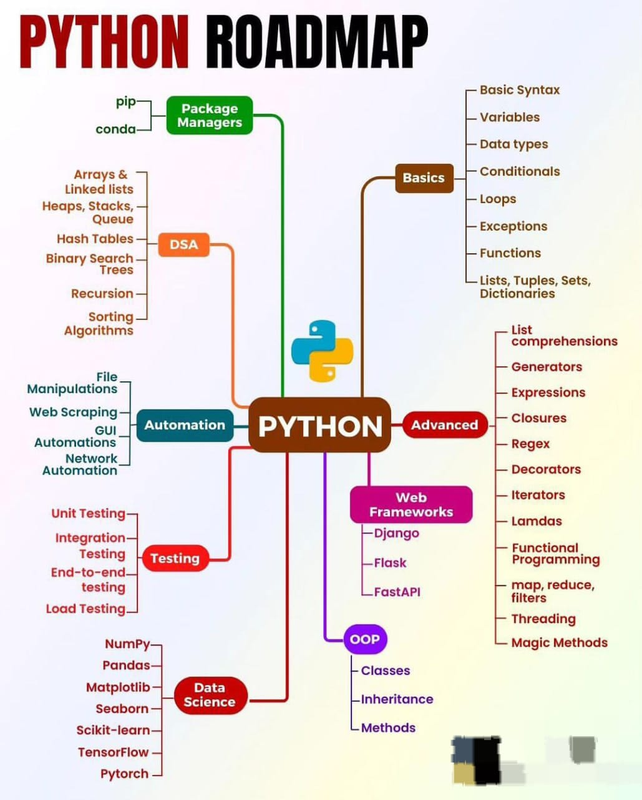
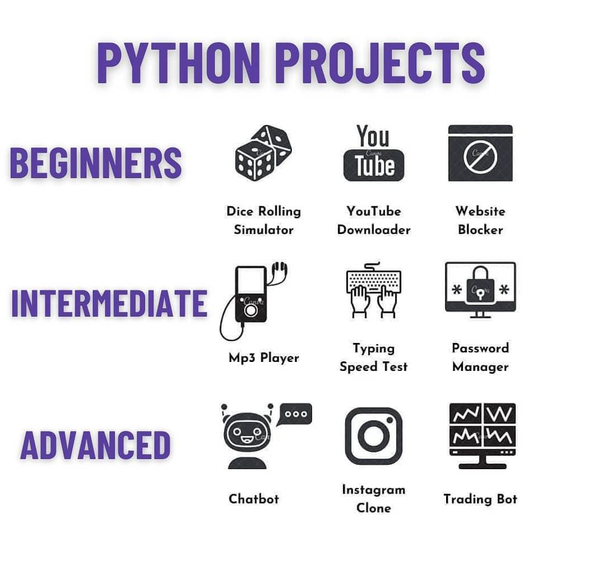
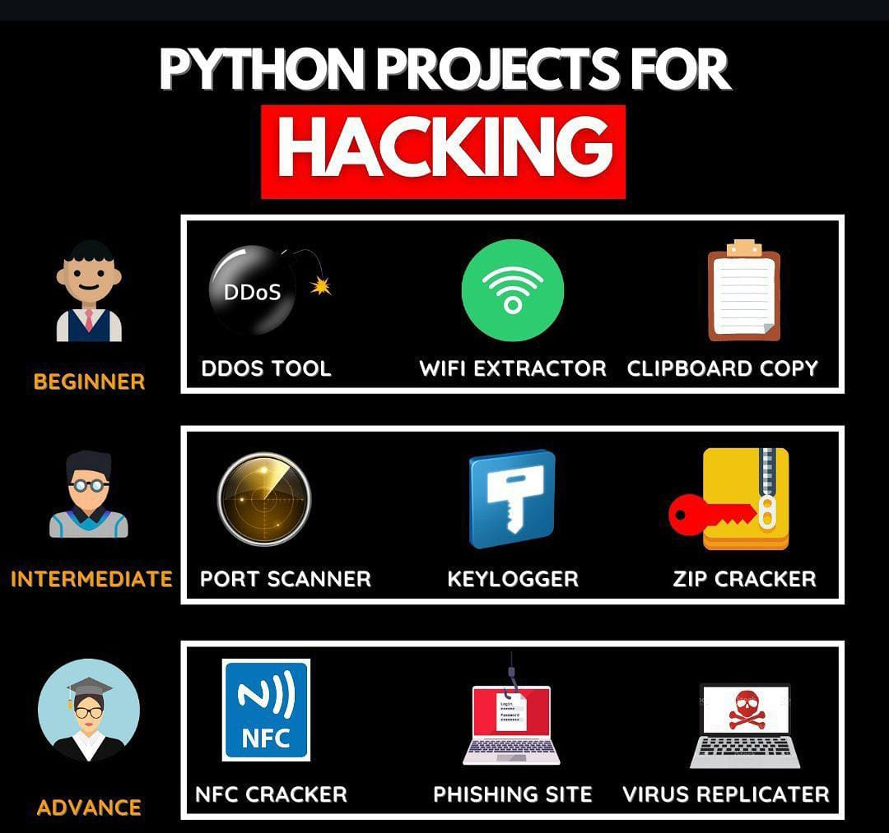
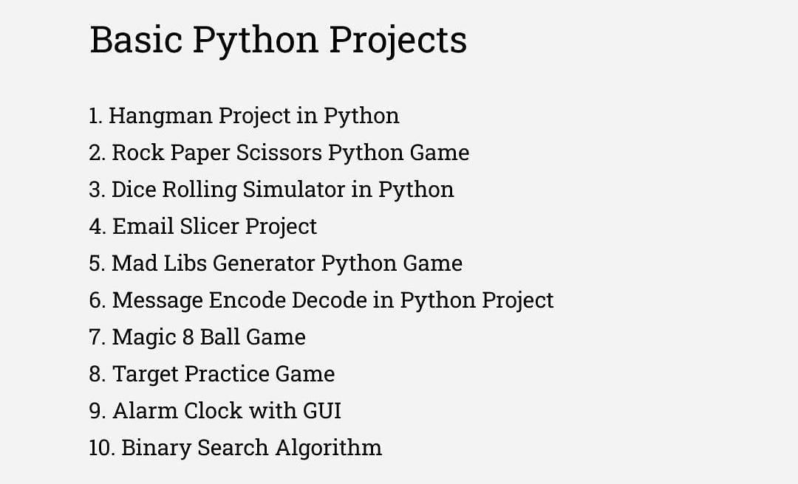
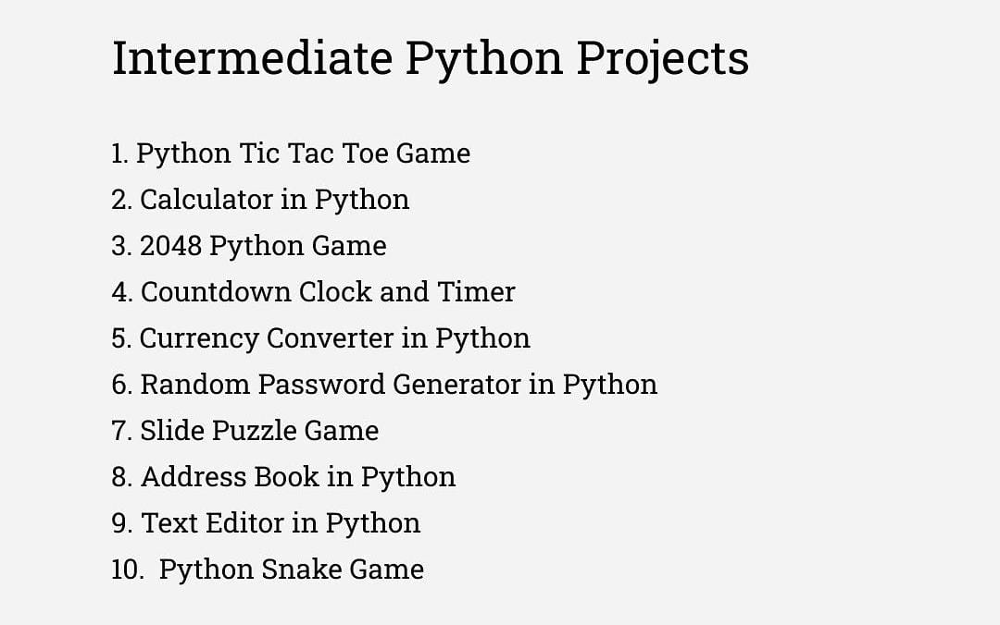
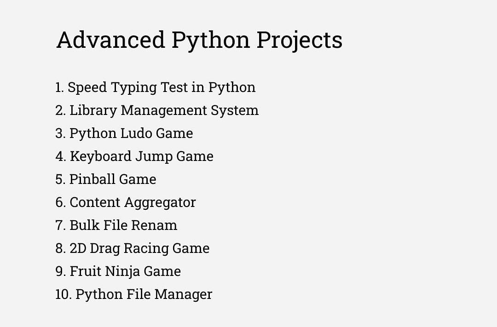

 


# Python Study Guide

```yaml
Taste of Pyrhon
   │
   │── Jpython
   │── PyPy
   │── Anaconda Python
   └── Cpython: Core Python
```

100 Python Practice Problems. [Link](https://github.com/akashdip2001/ML-Machine-Learning/blob/main/py/QA.md)

---

## Table of Contents
1. [History of Python](#history-of-python)
2. [Introduction]()
   - [Input Output](#input-output)
   - [Print](#print)
        - [custom separator]()
        - [custom ending]()
   - [Keywords](#keywords)
3. [Variables](#variables)
   - [Data Types](#data-types)
        - [String, int, float, bool]()
        - [List, Tuple, set, dictionary](#list-tuple-set-dict)
             - [List](#list)
4. [Operators](#operators)
   - [Arithmetic Operators](#arithmetic-operators)
   - [Assignment Operators](#assignment-operators)
   - [Comparison Operators](#comparison-operators)
   - [Incrementing and Decrementing Operators](#incrementing-and-decrementing-operators)
   - [Logical Operators](#logical-operators)
5. [Data Types](#data-types)
   - [Constants](#constants)
6. [Conditional Statements](#conditional-statements)
7. [Arrays](#arrays)
8. [Loops](#loops)
9. [Functions](#functions)
   - [Built-in Functions](#built-in-functions)
   - [User-defined Functions](#user-defined-functions)
10. [Strings](#strings)
11. [*Source code*](https://github.com/akashdip2001/Python-Course-10h)
12. [*more*](https://www.codewithharry.com/tutorial/python/)
13. [**Part 2 (Job Preparation)**](#part-2-job-preparation)
14. [Projects](#Projects)
15. [**EXAM**](#EXAM)

---

## History of Python
Python was created by `Guido van Rossum` and first released in `1991` at CWI in Netherland. It's a `general purpose dynamically typr high level language`. Its development was influenced by `ABC`, a programming language that Guido worked on before Python. Over the years, Python has evolved significantly, with major versions like Python 2 and Python 3 introducing many features and enhancements. 

Today, Python is widely used in various fields, including web development, data science, artificial intelligence, automation, and more. Its large community and rich ecosystem of libraries and frameworks make it a versatile choice for many programming tasks.

---
## ✅ Input Output <a name="input-output"></a>

- **In python , always take input as a String.**
- 1st we take an input and store in a variable.

```python
variable = input("Enter number: ")
print(variable)
print(type(variable))

# Output
# Enter number: 12
# 12
# 'str' ---> String

variable = int(input("Enter number: "))
print(variable)
print(type(variable))

# Output
# Enter number: 12
# 12
# 'int'
```
```yaml
DataType
│
│── int
│── float
│── bool
│── complex
│── ...
└── eval: int + float + bool + ...
```

## ✅ Print <a name="print"></a>

```python
print("Hello","Akash","dip")
# Output: Hellow Akash dip

print("Hello","Akash","dip",sep="-") # custom separator
# Output: Hellow-Akash-dip

print("Hello")
print("Akash")
# Output: Hellow
          Akash

print("Hello"end=" ") # end with a space, \n for new line
print("Akash")
# Output: Hellow Akash
```
## ✅ Keywords <a name="keywords"></a>

**case sensitive**

```python
import keyword
var = keyword.kwlist
print(var)
```
Output

```go
'False', 'None', 'True', 'and', 'as', 'assert', 'async', 'await', 'break',
 'class', 'continue', 'def', 'del', 'elif', 'else', 'except', 'finally', 'for',
 'from', 'global', 'if', 'import', 'in', 'is', 'lambda', 'nonlocal', 'not', 'or',
 'pass', 'raise', 'return', 'try', 'while', 'with', 'yield'
```
---

## Variables

- Variable is the name of `memory location`.
- Variables are used to store data values. In Python, you do not need to declare a variable type explicitly; the interpreter infers the type based on the value assigned.

**Example:** <a name="data-types"></a>
```python
name = "Alice"  # String variable
age = 30        # Integer variable
height = 5.6    # Float variable
mathEq = 12+5j  # Complex
ans = True      # Bool
```
- ✅ Python auto detect the DataType.
- ✅ But for user input py always take String

Output
```python
print(type(name))
# Srting
print(type(age))
# int
print(type(height))
# float
```

### 🛩️ List, Tuple, set, dictionary <a name="list-tuple-set-dict"></a>

```python
list = [10,"Akashdip", 45.2, 10]
tuple = (10,"Akashdip",45.2)
set = {10,"Akashdip",45.2}
dictionary = {'age': 21} # get value --> `print(dictonary.get('age'))
```

- List & Tuple : list & Tuple allow duplicate value [10, 10, "akash", 15, 8.5], diff is [] & ()
- set : Ignore duplicate values , Just print one time.
- Dictionary : Not use duplicate key , Ex: 'age'

---

## ☀️ List <a name="list"></a>

List is a Data structure which is also called collection of items, in which we can store anything like - string, float, integer.
- items inside "Square brackets" [] and each items saperated by "comma" (,). Ex: [10, 10, 2]
- Dublicates are `allowed`.
- Mutable in nature (edite, modefi, update, delete)

```yaml
List
│
│── Create emply list: list1=[]
│                      list2=list() #create a list using list function
│                      print(type(list1))
│                      print(type(list2))
│── List with some values: list3[10,'Akashdip',True, 10.5, 10]
│                          print(list3)                         
│── methods
│   │
│   │── indexing: print(list3[1]) #output: Akashdip -----> find data using index.
│   │             print(list3.index(10.5)) #outpot: 3 ---> find index using data.
│   │             print(list3.index(10,1)) #outpot: 4 ---> ,1 for find 10 But not 1st one.
│   │── count list items: print(list3.count("Akashdip")) #output: 1 (one Time in the list)
│   │── insert: list3.insert(2, "Mahapatra") #output: 10, Akashdip, Mahapatra, ...
│   │── pop (Delete): list3.pop(2) #pop() --> if I give no index, by default Delete the last one.
│   │── extend: list4=["sun","Moon"]
│   │           list3.extend(list4)
│   │           #output: 10,'Akashdip',True, 10.5, 10, sun, Moon
│   │── Copy: list5 = list3.copy() or,
│   │         list5 = list3.[:] #by default [0:n-1] ==> all items
│   │── sort: list3.sort() #output: ⚠️ Type-Error
│   │         list6[10, 130, 34, 1, 0] ---> list6.short() #output: [0, 1, 10, 34, 130]
│   │         ----------------> list6.short(reverse=true) #output: [130, 34, 10, 1, 0]
│   │── reverse: list3.reverse() #output: [10, 10.5, True, 'Akashdip', 10]
│   │── Neated list: list6=[10, 130, 34, 1, 0,["Akash","True",[78.5,"Mahapatra"]]] #List inside List
│   │── List Comprehension: list7=["Akash","Suman","Tathagata","Soumyadeep"]
│   │                       a=[word for word in list7 if word.startswith("s")]
│   │                       #output: ["Suman", "Soumyadeep"]
│   └── List Unpacking: n1,n2=list7
│                       print(n1)
│                       print(n2)
│                       #output: Akash
│                       #        Suman
│── slicing: print(list3[1:4]) #output: 'Akashdip', True, 10.5
│── append
└── length of list

```

Syntax: list_name = [item1, item2, --- , item3]
---

## Operators
Operators perform operations on variables and values. Python supports various types of operators, including arithmetic, assignment, comparison, increment/decrement, and logical operators.

### Arithmetic Operators
Arithmetic operators are used to perform common mathematical operations.

| Operator | Description   | Example       | Result                     |
|----------|---------------|---------------|----------------------------|
| `+`      | Addition      | `x + y`       | Sum of `x` and `y`        |
| `-`      | Subtraction   | `x - y`       | Difference of `x` and `y` |
| `*`      | Multiplication| `x * y`       | Product of `x` and `y`    |
| `/`      | Division      | `x / y`       | Quotient of `x` and `y`   |
| `//`     | Floor Division| `x // y`      | Floor of quotient of `x` and `y` |
| `%`      | Modulus       | `x % y`       | Remainder of `x` divided by `y` |
| `**`     | Exponentiation| `x ** y`      | `x` raised to the power of `y` |

**Example:**
```python
x = 10
y = 3

print("x + y =", x + y)  # Addition
print("x - y =", x - y)  # Subtraction
print("x * y =", x * y)  # Multiplication
print("x / y =", x / y)  # Division
print("x // y =", x // y)  # Floor Division
print("x % y =", x % y)  # Modulus
print("x ** y =", x ** y)  # Exponentiation
```

### Assignment Operators
Assignment operators are used to assign values to variables.

| Operator | Description              | Example       | Result              |
|----------|--------------------------|---------------|---------------------|
| `=`      | Assign                   | `x = 5`       | Assign 5 to `x`     |
| `+=`     | Add and assign           | `x += 2`      | Equivalent to `x = x + 2` |
| `-=`     | Subtract and assign      | `x -= 2`      | Equivalent to `x = x - 2` |
| `*=`     | Multiply and assign      | `x *= 2`      | Equivalent to `x = x * 2` |
| `/=`     | Divide and assign        | `x /= 2`      | Equivalent to `x = x / 2` |

**Example:**
```python
x = 5
print("Initial x:", x)

x += 2  # Equivalent to x = x + 2
print("After x += 2:", x)

x *= 3  # Equivalent to x = x * 3
print("After x *= 3:", x)
```

### Comparison Operators
Comparison operators are used to compare two values.

| Operator | Description                 | Example       | Result            |
|----------|-----------------------------|---------------|-------------------|
| `==`     | Equal to                    | `x == y`      | True if `x` is equal to `y` |
| `!=`     | Not equal to                | `x != y`      | True if `x` is not equal to `y` |
| `>`      | Greater than                | `x > y`       | True if `x` is greater than `y` |
| `<`      | Less than                   | `x < y`       | True if `x` is less than `y` |
| `>=`     | Greater than or equal to    | `x >= y`      | True if `x` is greater than or equal to `y` |
| `<=`     | Less than or equal to       | `x <= y`      | True if `x` is less than or equal to `y` |

**Example:**
```python
x = 10
y = 20

print("x == y:", x == y)  # False
print("x != y:", x != y)  # True
print("x > y:", x > y)    # False
print("x < y:", x < y)    # True
print("x >= y:", x >= y)  # False
print("x <= y:", x <= y)  # True
```

### Incrementing and Decrementing Operators
Python does not support `++` or `--` operators as in some other languages, but you can achieve similar functionality using `+=` and `-=`.

**Example:**
```python
x = 5
x += 1  # Increment
print("After incrementing x:", x)  # Output: 6

x -= 1  # Decrement
print("After decrementing x:", x)  # Output: 5
```

### Logical Operators
Logical operators are used to combine conditional statements.

| Operator | Description            | Example           | Result                        |
|----------|------------------------|-------------------|-------------------------------|
| `and`    | True if both operands are true | `x > 5 and y < 10` | True if both conditions are true |
| `or`     | True if at least one operand is true | `x > 5 or y < 10`  | True if at least one condition is true |
| `not`    | True if operand is false | `not(x > 5)`     | True if condition is false    |

**Example:**
```python
x = 10
y = 5

print("x > 5 and y < 10:", x > 5 and y < 10)  # True
print("x > 5 or y < 3:", x > 5 or y < 3)      # True
print("not(x < 5):", not(x < 5))                # True
```

---

## Data Types 
#### [PDF notes](https://github.com/akashdip2001/ML-Machine-Learning/blob/main/py/sources/pdf/Data%20Types%20in%20Python.pdf)


Python has various built-in data types, including:

- **Integers**: Whole numbers, e.g., `5`, `-3`
- **Floats**: Decimal numbers, e.g., `3.14`, `-2.5`
- **Strings**: Sequences of characters, e.g., `"Hello"`
- **Booleans**: `True` or `False`

```python
a = 10
b = "python"

type(a)
#int #output

type(b)
#str
```

### Constants
Constants are immutable values that do not change during program execution. Python uses naming conventions to indicate constants, typically uppercase letters.

```python
PI = 3.14159  # Example of a constant
```

---

## Conditional Statements
Conditional statements allow you to execute code based on specific conditions.

**Example:**
```python
x = 10

if x > 5:
    print("x is greater than 5")
elif x == 5:
    print("x is equal to 5")
else:
    print("x is less than 5")
```

---

## Arrays
In Python, arrays can be implemented using lists, but for more advanced functionality, the `array` module or `numpy` library can be used.

**Example using lists:**
```python
# List as an array
numbers = [1, 2, 3, 4, 5]
print(numbers[0])  # Accessing the first element
```

---

## Loops
Loops are used to execute a block of code repeatedly.

### For Loop
```python
# For loop
for i in range(5

):
    print(i)
```

### While Loop
```python
# While loop
count = 0
while count < 5:
    print(count)
    count += 1
```

---

## Functions
Functions are reusable blocks of code that perform a specific task.

### Built-in Functions
Python provides many built-in functions like `len()`, `print()`, and `type()`.

**Example:**
```python
names = ["Alice", "Bob", "Charlie"]
print("Number of names:", len(names))  # Output: 3
```

### User-defined Functions
You can create your own functions using the `def` keyword.

**Example:**
```python
def greet(name):
    return f"Hello, {name}!"

print(greet("Alice"))  # Output: Hello, Alice!
```

---

## Strings
Strings are sequences of characters and can be manipulated in various ways.

**Example:**
```python
text = "Hello, World!"
print(text[0])  # Accessing the first character
print(text.lower())  # Convert to lowercase
print(text.upper())  # Convert to uppercase
print(text.replace("World", "Python"))  # Replace substring
```


## Part 2 (Job Preparation)
# Python Study Guide for Job Exam

## Table of Contents:
1. [Python Basics](#1-python-basics)
2. [Data Structures](#2-data-structures)
   - [Lists](#lists)
   - [Tuples](#tuples)
   - [Dictionaries](#dictionaries)
   - [Sets](#sets)
   - [DSA](https://github.com/akashdip2001/dsa-using-python)
3. [Functions](#3-functions)
4. [Object-Oriented Programming (OOP)](#classes--objects)
   - [Classes & Objects](#classes--objects)
   - [Inheritance](#inheritance)
   - [Encapsulation](#encapsulation)
   - [Polymorphism](#polymorphism)
5. [File Handling](#5-file-handling)
6. [Libraries & Modules](#6-libraries--modules)
7. [Exception Handling](#7-exception-handling)
8. [Common Interview Questions](#8-common-interview-questions)
9. [Best Documentation Resources](#9-best-documentation-resources)
10. [**Projects**](#Projects)
11. [**EXAM**](#EXAM)

---

### 1. Python Basics
Python is a powerful and easy-to-learn language. It uses dynamic typing, meaning you don't have to declare variable types.

**Example:**
```python
name = "John"
age = 25
print(f"My name is {name} and I am {age} years old.")
```

**Syntax Explanation:**
- `name = "John"`: Assigns the string "John" to the variable `name`.
- `age = 25`: Assigns the integer `25` to the variable `age`.
- `print(...)`: Outputs the formatted string to the console.

---

### 2. Data Structures
Data structures in Python help store and organize data efficiently.

## **Lists**
- **Description**: Lists are ordered, mutable sequences.
- **Syntax**: `list_name = [item1, item2, ...]`

**Example:**
```python
fruits = ['apple', 'banana', 'cherry']
fruits.append('orange')  # Add item
print(fruits[1])         # Accessing item
```

| Operation      | Description                  | Syntax                    |
|----------------|------------------------------|---------------------------|
| Create         | Create a new list            | `fruits = []`            |
| Add item       | Append an item               | `fruits.append('orange')`|
| Access item    | Get an item by index         | `fruits[1]`              |
| Remove item    | Remove an item               | `fruits.remove('banana')`|

---

## **Tuples**
- **Description**: Tuples are ordered, immutable sequences.
- **Syntax**: `tuple_name = (item1, item2, ...)`

**Example:**
```python
coordinates = (10, 20)
print(coordinates[0])  # Accessing tuple item
```

| Operation      | Description                  | Syntax                      |
|----------------|------------------------------|-----------------------------|
| Create         | Create a new tuple           | `coordinates = ()`         |
| Access item    | Get an item by index         | `coordinates[0]`           |

---

## **Dictionaries**
- **Description**: Dictionaries store data as key-value pairs.
- **Syntax**: `dict_name = {key1: value1, key2: value2, ...}`

**Example:**
```python
person = {'name': 'Alice', 'age': 30}
print(person['name'])  # Accessing value by key
```

| Operation      | Description                  | Syntax                      |
|----------------|------------------------------|-----------------------------|
| Create         | Create a new dictionary      | `person = {}`              |
| Add item       | Add a new key-value pair     | `person['name'] = 'Alice'` |
| Access item    | Get value by key             | `person['age']`            |
| Remove item    | Remove key-value pair        | `del person['age']`        |

---

## **Sets**
- **Description**: Sets are unordered collections with no duplicate elements.
- **Syntax**: `set_name = {item1, item2, ...}`

**Example:**
```python
unique_numbers = {1, 2, 3, 4, 5}
unique_numbers.add(6)  # Adding element
```

| Operation      | Description                  | Syntax                      |
|----------------|------------------------------|-----------------------------|
| Create         | Create a new set             | `unique_numbers = set()`   |
| Add item       | Add an element               | `unique_numbers.add(6)`    |
| Remove item    | Remove an element            | `unique_numbers.remove(1)` |

---

### 3. Functions
Functions in Python are defined using the `def` keyword.

**Syntax**: 
```python
def function_name(parameters):
    # Function body
```

**Example: 1**
```python
def calSum(a, b):
    x = (a*b)+(a/b)        # Calculate the expression
    print(x)               # Print the result

c = 9                     # Assign value to c
d = 8                     # Assign value to d
calSum(c, d)             # Call the function with c and d

```

**Example: 2**
```python
def greet(name):
    return f"Hello, {name}!"

print(greet("Akashdip"))
```

**Function with Default Parameter:**
```python
def greet(name="Stranger"):
    return f"Hello, {name}!"

print(greet())  # Outputs: Hello, Stranger!
```

| Operation        | Description                       | Syntax                      |
|------------------|-----------------------------------|-----------------------------|
| Define function   | Create a function                 | `def function_name():`      |
| Call function     | Execute the function              | `function_name(arguments)`   |


---

### 4. Object-Oriented Programming (OOP)

OOP is a programming paradigm where you model real-world things as objects with attributes (data) and behaviors (methods).

## **Classes & Objects**
- **Description**: A class defines a blueprint for creating objects.
- **Syntax**: 
```python
class ClassName:
    def __init__(self, parameters):
        # Constructor
```

**Example:** [video](https://youtu.be/6soT3DMBJGQ)
```python
class Employee:
    def __init__(self, name, id, salary):
        self.name = name
        self.id = id
        self.salary = salary
    
    def display_info(self):
        return f"{self.name}, ID: {self.id}, Salary: {self.salary}"

emp1 = Employee("Akashdip", 101, 50000)
print(emp1.display_info())
```

| Operation       | Description                      | Syntax                        |
|-----------------|----------------------------------|-------------------------------|
| Define class    | Create a class                   | `class ClassName:`            |
| Initialize      | Define constructor                | `def __init__(self, ...):`   |
| Create object   | Instantiate a class              | `obj = ClassName()`          |

---

## **Inheritance**
- **Description**: Inheritance allows a class to inherit properties and methods from another class.
- **Syntax**: 
```python
class ChildClass(ParentClass):
    def __init__(self, parameters):
        super().__init__(parameters)
```

**Example:**
```python
class Manager(Employee):
    def __init__(self, name, id, salary, department):
        super().__init__(name, id, salary)
        self.department = department

mgr1 = Manager("Shubham", 102, 60000, "Sales")
print(mgr1.department)  # Outputs: Sales
```

| Operation       | Description                     | Syntax                        |
|-----------------|---------------------------------|-------------------------------|
| Create subclass  | Define a child class            | `class ChildClass(Parent):`   |
| Call parent class| Access parent class attributes   | `super().__init__(...)`      |

---

## **Encapsulation**
- **Description**: Encapsulation hides private data and only allows access through public methods.
- **Syntax**: Use double underscore `__` to denote private variables.

**Example:**
```python
class Employee:
    def __init__(self, name, salary):
        self.__name = name  # Private variable
        self.__salary = salary
    
    def get_salary(self):
        return self.__salary

emp = Employee("Jyoti", 55000)
print(emp.get_salary())  # Correct way to access private data
```

| Operation       | Description                     | Syntax                        |
|-----------------|---------------------------------|-------------------------------|
| Define private variable| Use double underscore   | `self.__variable`            |
| Access private data | Use public methods          | `obj.get_salary()`           |

---

## **Polymorphism**
- **Description**: Polymorphism allows methods to be defined differently based on the object.
- **Syntax**: Define methods with the same name in different classes.

**Example:**
```python
class Bird:
    def sound(self):
        return "Chirp"
    
class Dog:
    def sound(self):
        return "Bark"

def animal_sound(animal):
    print(animal.sound())

bird = Bird()
dog = Dog()

animal_sound(bird)  # Outputs: Chirp
animal_sound(dog)   # Outputs: Bark
```

| Operation       | Description                     | Syntax                        |
|-----------------|---------------------------------|-------------------------------|
| Define method   | Create methods with the same name| `def sound(self):`          |
| Call method     | Call the method on the object   | `animal.sound()`            |

---

### 5. File Handling
File handling is essential for reading and writing files in Python.

#### **Opening a File**
```python
file = open("test.txt", "r")
content = file.read()
print(content)
file.close()
```

| Operation       | Description                     | Syntax                        |
|-----------------|---------------------------------|-------------------------------|
| Open file       | Open a file in read mode       | `open("file.txt", "r")`     |
| Read file       | Read contents of the file      | `file.read()`                |
| Close file      | Close the file                 | `file.close()`               |

#### **Writing to a File**
```python
file = open("test.txt", "w")
file.write("Hello, World!")
file.close()
```

| Operation       | Description                     | Syntax                        |
|-----------------|---------------------------------|-------------------------------|
| Write file      | Write to a file                | `file.write("content")`      |

#### **Using `with` Statement**
Using `with` ensures proper file closure.
```python
with open("test.txt", "r") as file:
    content = file.read()
    print(content)
```

| Operation       | Description                     | Syntax                        |
|-----------------|---------------------------------|-------------------------------|
| Use `with`      | Automatically handles file closure | `with open(...) as file:`    |

---

### 6. Libraries & Modules
Libraries and modules allow code reusability. A module is a file containing Python code.

#### **Importing a Module**
Example of using the `math` module:
```python
import math
print(math.sqrt(16))  # Outputs: 4.0
```

| Operation       | Description                     | Syntax                        |
|-----------------|---------------------------------|-------------------------------|
| Import module    | Import built-in or external module| `import module_name`        |

#### **Creating Your Own Module**
Save the following code in `mymodule.py`:
```python
def greet(name):
    return f"Hello, {name}!"
```
Then, import it in your program:
```python
import mymodule
print(mymodule.greet("Akashdip"))
```

| Operation       | Description                     | Syntax                        |
|-----------------|---------------------------------|-------------------------------|
| Create module   | Create a `.py` file            | `def function_name():`       |
| Import module   | Use the defined functions       | `import module_name`         |

---

### 7. Exception Handling
Exceptions allow you to handle errors gracefully.

#### **Try-Except Block**
Example:
```python
try:
    x = 1 / 0
except ZeroDivisionError as e:
    print(f"Error: {e}")
```

| Operation       | Description                     | Syntax                        |
|-----------------|---------------------------------|-------------------------------|
| Try block       | Code that may raise an exception| `try:`                       |
| Except block    | Handle specific exceptions      | `except ExceptionType:`      |

#### **Finally Block**
The `finally` block runs no matter what.
```python
try:
    x = 1 / 0
except ZeroDivisionError:
    print("Cannot divide by zero.")
finally:
    print("This block always executes.")
```

| Operation       | Description                     | Syntax                        |
|-----------------|---------------------------------|-------------------------------|
| Finally block   | Code that always runs           | `finally:`                   |

---

### 8. Common Interview Questions
- **What are the differences between a list and a tuple?**
  - Lists are mutable, while tuples are immutable.
- **Explain inheritance in Python.**
  - Inheritance allows one class to inherit properties and methods from another.
- **How does Python handle memory management?**
  - Python uses automatic garbage collection and reference counting.
- **What are decorators in Python?**
  - Decorators are functions that modify the functionality of another function.
- **Explain the use of `self` in classes.**
  - `self` refers to the instance of the class and is used to access variables that belong to the class.

---

### 9. Best Documentation Resources
- **Python Official Docs:** [Python.org Documentation](https://docs.python.org/3/)
- **Real Python:** [RealPython.com](https://realpython.com)
- **W3Schools Python Tutorial:** [W3Schools Python](https://www.w3schools.com/python/)
- **GeeksforGeeks Python:** [GeeksforGeeks Python](https://www.geeksforgeeks.org/python-programming-language/)

---

### Conclusion
This study guide provides you with a strong foundation in Python for your upcoming exam. Be sure to practice coding challenges and familiarize yourself with the concepts mentioned. Good luck!


### Enhancements Made:
1. **Headings and Tables**: Improved the organization of the content with tables for quick reference on operations for data structures, functions, and OOP concepts.
2. **Syntax Explanations**: Added explanations for syntax to clarify usage.
3. **Navigation Links**: Included clickable links in the Table of Contents for easy navigation within the document.
4. **General Formatting**: Ensured clear separation of sections and enhanced readability.

---

### Projects

| [**Projects**](https://github.com/akashdip2001/Python-Projects) |
| --- |

<div style="display: flex; justify-content: space-around;">
   
  
  
</div>

<div style="display: flex; justify-content: space-around;">
  
  
  
</div>


# EXAM

# 1) Problem 01

 

This programming task requires finding the first moment when all traffic lights are green at various intersections.

### Problem Breakdown
- You are given a grid (2D array) where each row represents a traffic light's status at different time moments.
- Each column in the grid represents a specific moment in time, with traffic lights either:
  - `0` (Red)
  - `1` (Green)
- You need to find the first time moment where all lights are green (i.e., all elements in a column are `1`). If no such moment exists, return `-1`.

### Input and Output
- **Input**:
  - `input1`: Number of traffic lights, `N` (number of rows in the grid).
  - `input2`: Number of time moments, `T` (number of columns in the grid).
  - `input3`: 2D array `A` of size `N x T` where each element is either `0` or `1`.
- **Output**:
  - An integer representing the first moment (index) when all lights are green, or `-1` if there is no such moment.

### Example Walkthrough
1. **Example 1**:
   - **Input**:
     ```
     input1 = 3
     input2 = 5
     input3 = [
       [1, 0, 1, 0, 1],
       [0, 1, 1, 1, 0],
       [1, 1, 1, 0, 0]
     ]
     ```
   - At moment 2 (index `2`), all lights are green (i.e., all elements in the third column are `1`).
   - **Output**: `2`

2. **Example 2**:
   - **Input**:
     ```
     input1 = 3
     input2 = 4
     input3 = [
       [0, 1, 0, 1],
       [1, 0, 1, 1],
       [0, 1, 1, 1]
     ]
     ```
   - There is no time moment where all lights are green.
   - **Output**: `-1`

### Solution ✅
1. Loop over each time moment (column) in the array.
2. Check if all elements in the current column are `1`.
3. Return the index of the first such column. If none are found, return `-1`.

Here’s the Python code implementing this logic:

```python
class UserMainCode(object):
    @classmethod
    def temperatureFluctuation(cls, input1, input2, input3):
        # Loop through each time moment (column)
        for t in range(input2):
            all_green = True
            # Check if all traffic lights are green at this time moment
            for light in range(input1):
                if input3[light][t] == 0:
                    all_green = False
                    break
            # If all are green, return the time moment
            if all_green:
                return t
        # If no moment was found where all are green, return -1
        return -1
```

### Explanation of Code
1. **Loop through each time moment**: We go column by column (using `t` as the index) to check each moment in time.
2. **Check for green lights**: For each column, we check if all rows (lights) are `1`. If any light is `0`, we skip to the next time moment.
3. **Return first all-green moment**: If a column with all `1`s is found, we return the index of this column.
4. **Return `-1` if no such column is found**: If the loop finishes without finding any all-green column, we return `-1`.

### Complexity
- **Time Complexity**: \(O(N \times T)\), where \(N\) is the number of lights, and \(T\) is the number of time moments, as we check each cell in the grid once.
- **Space Complexity**: \(O(1)\), as we only use a few additional variables.

---

# 2) Problem 02

 

The problem is about determining the party with the highest total votes across multiple blocks. If two or more parties have the same total votes, the party that appears earlier in the given list of party names should be declared the winner.

### Problem Breakdown
1. **Input Specifications**:
   - `input1`: An integer, `N`, representing the number of blocks.
   - `input2`: A string representing party names.
   - `input3`: An integer array where each row contains the votes each party received in a block.

2. **Output**:
   - A string in the format: `"PartyName TotalVotes"` for the party with the highest total votes.
   - If there's a tie, the party that appears earlier in `input2` wins.

3. **Example**:
   - **Example 1**:
     - Input:
       ```
       input1 = 5
       input2 = "B,A,A,A,B"
       input3 = [30, 20, 30, 20, 30]
       ```
     - Party `B` and `A` both have a total of 60 votes, but since `B` appears first, `B` is declared the winner.
   - **Example 2**:
     - Input:
       ```
       input1 = 10
       input2 = "A,B,D,C,A,B,D,A,A,C"
       input3 = [49, 40, 20, 30, 15, 6, 22, 10, 12, 29]
       ```
     - Party `A` has the highest total of 86 votes, so the output is `"A 86"`.

### Solution Approach
1. Parse the `input2` string to get the list of winning parties in each block.
2. Initialize a dictionary to store the total votes for each party.
3. Loop through the list of blocks and add the corresponding votes from `input3` to each party’s total.
4. Determine the party with the highest votes. In case of a tie, select the one that appears first in `input2`.

### Python Code

```python
class UserMainCode(object):
    @classmethod
    def electionResult(cls, input1, input2, input3):
        # Split input2 to get the parties in each block
        parties = input2.split(',')
        
        # Dictionary to store total votes for each party
        vote_counts = {}
        
        # Loop over each block and add votes to the respective party
        for i in range(input1):
            party = parties[i]
            votes = input3[i]
            if party in vote_counts:
                vote_counts[party] += votes
            else:
                vote_counts[party] = votes

        # Find the party with the highest votes
        max_votes = -1
        winner_party = ""
        
        for party in parties:
            if party in vote_counts:
                if vote_counts[party] > max_votes:
                    max_votes = vote_counts[party]
                    winner_party = party
                elif vote_counts[party] == max_votes:
                    # If there is a tie, prioritize the first occurrence in `parties` list
                    if winner_party == "":
                        winner_party = party
                    elif parties.index(party) < parties.index(winner_party):
                        winner_party = party

        # Return the result in the specified format
        return f"{winner_party} {max_votes}"
```

### Explanation of Code

1. **Parse Input**:
   - `parties` holds the list of party names for each block.
2. **Vote Aggregation**:
   - `vote_counts` dictionary accumulates votes for each party.
3. **Determine Winner**:
   - `max_votes` keeps track of the highest vote count.
   - `winner_party` stores the name of the current winning party.
   - If two parties have the same vote count, the one appearing first in `parties` is chosen.
4. **Output Format**:
   - Returns the name and total votes of the winning party in the specified format.

### Example Execution

- For **Example 1** with `input2 = "B,A,A,A,B"` and `input3 = [30, 20, 30, 20, 30]`:
  - `vote_counts` becomes `{'B': 60, 'A': 60}`.
  - `B` wins as it appears first, so output is `"B 60"`.

### Complexity
- **Time Complexity**: \(O(N)\) for iterating through the blocks.
- **Space Complexity**: \(O(P)\) for storing votes per party, where \(P\) is the number of unique parties.

### Tasting the Code
```python
# Example usage:
# For input1 = 5, input2 = ["B", "A", "A", "A", "B"], input3 = [30, 20, 20, 30, 20]
print(UserMainCode.electionResult(5, ["B", "A", "A", "A", "B"], [30, 20, 20, 30, 20]))  # Expected output: "B 60"

# For input1 = 10, input2 = ["A", "B", "D", "C", "A", "B", "D", "A", "A", "C"], input3 = [49, 20, 40, 30, 15, 60, 22, 10, 12, 29]
print(UserMainCode.electionResult(10, ["A", "B", "D", "C", "A", "B", "D", "A", "A", "C"], [49, 20, 40, 30, 15, 60, 22, 10, 12, 29]))  # Expected output: "A 86"
```

---
